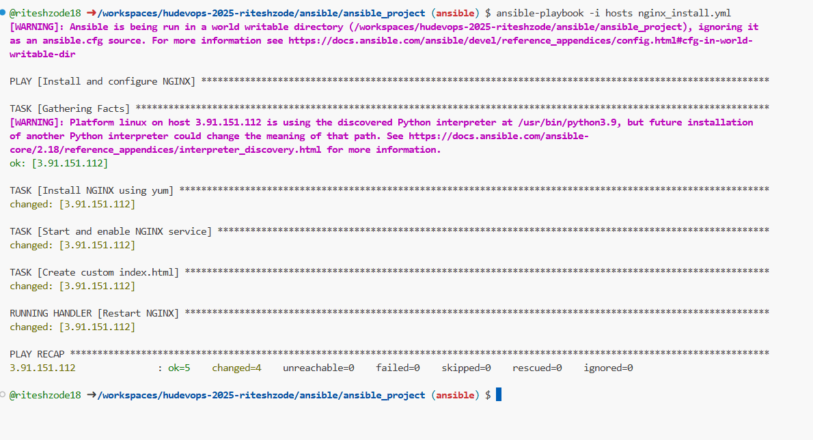

### Ansible Assignment
## Task 1: Write the below mentioned roles and call them in the ansible playbook.
1. Role 1: Deploy a server with the smallest size in AWS (t3.micro). capture the public-ip 
of the server on the fly.
2. Role 2: Add the line GatewayPorts clientspecified and update the line
#AllowTcpForwarding yes to AllowTcpForwarding yes in the SSH configuration file. 
Restart the SSH service. Update the hostname of the server to trainee-name and 
ensure the updated hostname is reflected when logging into the server. To achieve 
this, either do a graceful reboot without letting the playbook exit or restart the specific 
service to update the hostname.
3. Role 3: Create a user on the server named trainee-name. The User should have its own 
home directory and no access to root folder. This role should only run if the hostname 
is trainee-name. Install apache web server in the machine. 
The roles should be called in the following order in the playbook:
i. Role 1
ii. Role 2
iii. Role 3 (Should run on the condition when the hostname is 'trainee-name')
Note: Role 2, 3 should be delegated to the public IP captured on the fly in the playbook.
The playbook should also have a separate README.md file.

code : ansible_roles_project


## Task 2: Create an Ansible playbook that incorporates the following roles:
1. Deploying an EC2 server
2. Installing Nginx
3. Deploying a custom homepage using a template
4. Ensuring the Nginx service is started and enabled.
The playbook should use handlers as well.

code : ansible_project
note: 
1. ec2 instance creation part is skipped
2. host name is updated manually




## Task 3: Create an Ansible dynamic inventory script to manage instances deployed 
in AWS EC2. The inventory should specifically target instances with the tag 
role=web and update Nginx on those instances.

code: ansible_dynamic_inventory

### step 1: python main.py file will get all the instance that matched with the tag (key:role, value:web) and update the host file


### step 2: ansible playbook wil install nginx with custom nome page
```
ansible-playbook -i hosts play_book.yml
```


### note: I done nginx installation process of only one server

