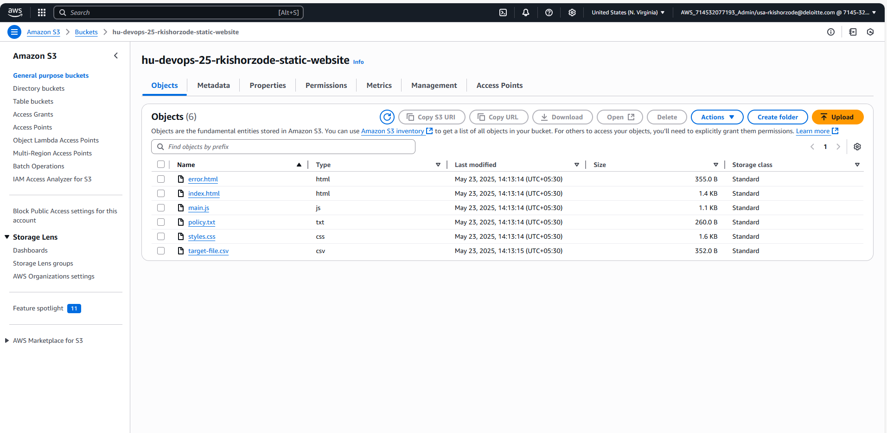
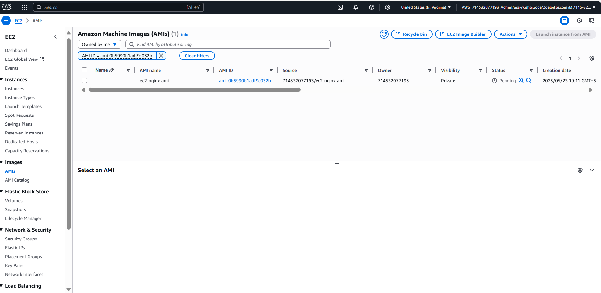

### Question for Migration Track in HU
1
Use Case: Migrating a static website to AWS S3.
• Description: This involves moving a simple static website (e.g., HTML, CSS, JavaScript) to AWS S3 
for hosting.
• Objective:
1. Create an S3 bucket in the AWS Management Console.
2. Upload the static website files to the S3 bucket.
3. Configure the bucket to host a static website.
4. Set up the necessary permissions to make the website publicly accessible.

2.
Use Case: Migrating a small web application to AWS Elastic Beanstalk.
• Description: This involves deploying a small web application (e.g., a Node.js or Python application) to 
AWS Elastic Beanstalk.
• Objective:
1. Package the application code and dependencies.
2. Create an Elastic Beanstalk environment in the AWS Management Console.
3. Deploy the application to the Elastic Beanstalk environment.
4. Configure environment settings such as scaling, monitoring, and logging.

## Question for Disaster Recovery Track in HU

Scenario 01: 
Your team is preparing for an upcoming maintenance window to update a critical EC2 instance hosting a web 
server with new security patches. However, there is concern that the update might disrupt the system. To 
ensure you can quickly revert to a working version of the web server in case of failure, you need to implement 
a strategy that allows you to restore the instance to its current state with minimal downtime.
 
answer:
i will create AMI of ec2 instance so i can craete instance with autoscaling in failover situation
or
EBS snapshots for backup

<!--  -->

<!--  -->

<!--  -->

Scenario 02: 
Your organization needs to ensure business continuity and data protection for a critical application hosted in a Virtual 
Machine (VM) on Azure. To achieve this, you must implement an automated disaster recovery solution that regularly 
takes snapshots of the VM. These snapshots will serve as backups, allowing for quick recovery in case of data loss or 
system failure. (Create VM of type B2s and select OS as linux, Ubuntu 20.04).

## Question for Resiliency Track in HU

Prerequisites: -
Setup the minikube cluster in local
Start the minikube with maximum resources (minikube start --memory 8192 --cpus 2)
Install Litmus tool in minikube cluster

Assignment – 1
Perform the following experiments
Deploy sample nginx server on minikube
i) Pod delete
ii) Pod cpu hog 

Assignment – 2
Clone the given repository in minikube cluster (https://github.com/Java-Techie-jt/springboot-k8s-yaml.git) 
deploy this sample spring boot application by adding required dependencies in pom.xml and 
application.properties, create a required jar file, build the docker image and deploy it in the cluster
Perform the following chaos experiments in litmus
i) Spring boot app kill
ii) Spring boot memory stress
Monitor the actions in any of the monitoring tools like Prometheus, Grafana and note down the results

Acceptance criteria: -
i) Create a neat document with all the necessary steps and required screenshots with the explanation
ii) Terminate the ec2-instance after successfully performing the experiment
iii) Follow the security best practices during the entire track
You have to push all the documents to git with best practices after that there is no acceptance.

