# Cloud Assignment DAY 1

## Task 1: EC2 and Storage Management. 
- Subtask 1.1: Launch a Private Linux EC2 instance. (Choose Ubuntu with t2. micro). 
- Subtask 1.2: Create an EBS volume with 10GB of storage, attach it to the created 
instance, and resize the volume to 15GB ensure the change reflects inside the instance. 
- Subtask 1.3: Deploy a sample nginx page in a private EC2 instance via init script and 
expose it via an Application Load Balancer

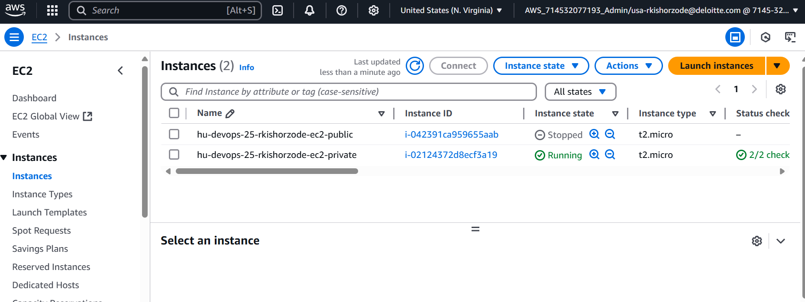

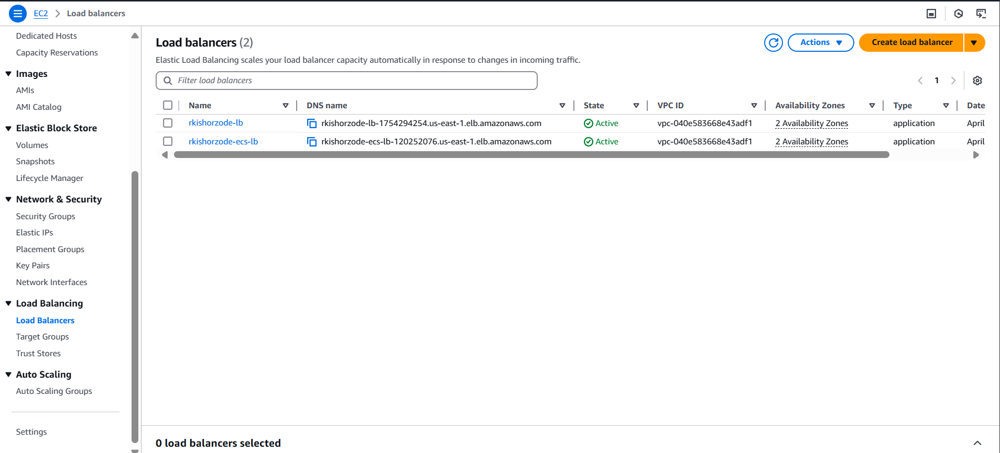

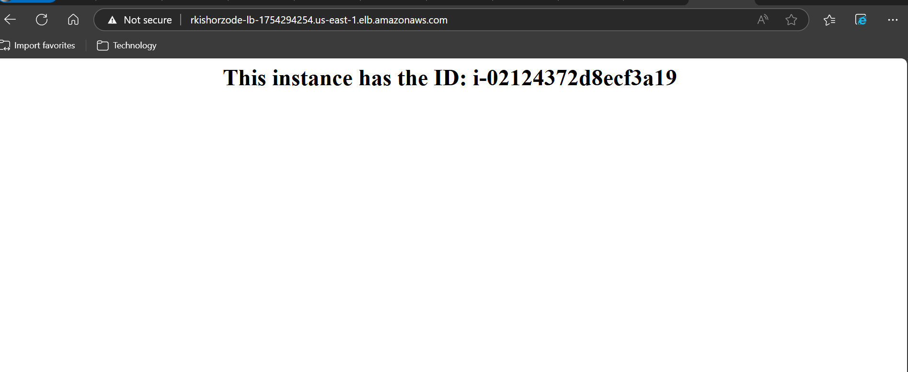

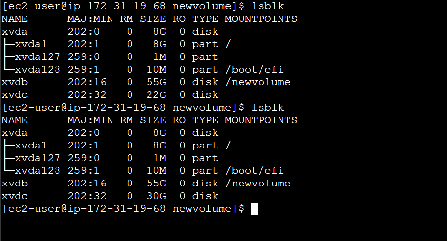

## Task 2: Serverless Architecture Setup. 
- Subtask 2.1: Create a sample Python Lambda function. 
- Subtask 2.2: Set the Lambda trigger as SQS and send a message to test the invocation. 
- Subtask 2.3: Attach the proof of lambda invocation through SQS. Attach screenshots of 
CloudWatch logs with the message from Lambda test invocation.

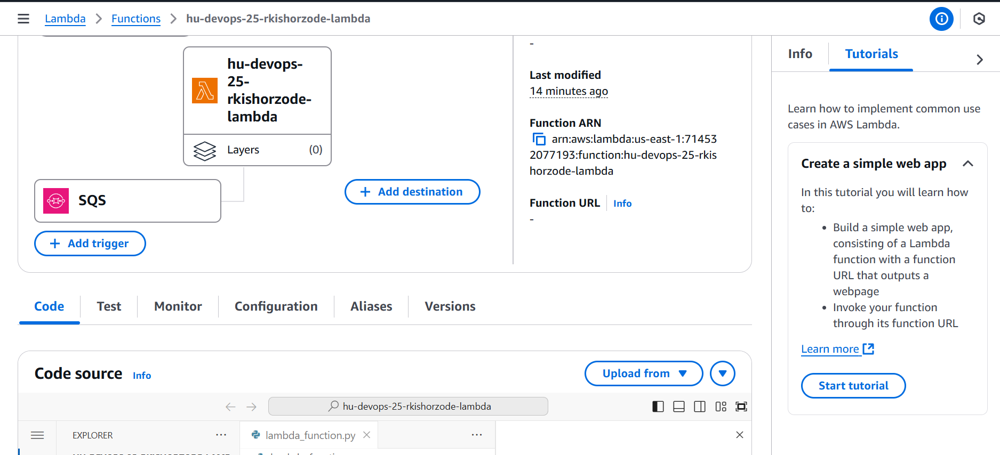

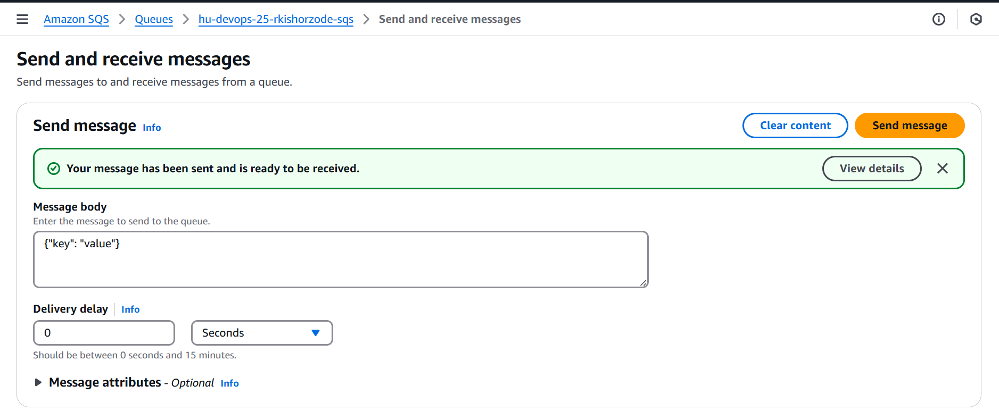

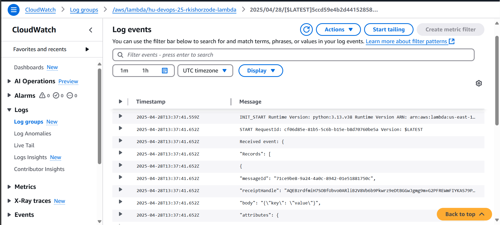

## Task 3: Static Website Hosting and S3 Management. 
- Subtask 3.1: Create a private S3 bucket and enable versioning to host a static website 
and upload index.html and error.html pages. Block Public access for S3 bucket.
- Subtask 3.2: Add a lifecycle rule to the bucket: Transition from Standard to Standard-IA 
in 30 days and expire objects in 200 days. Enable versioning and re-upload any 2 files to 
verify. 
- Subtask 3.3: Host the site for above S3 static website using cost effective way.

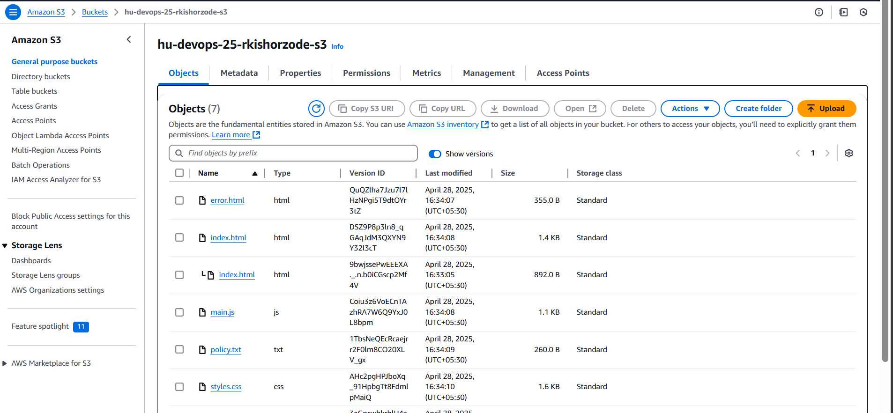

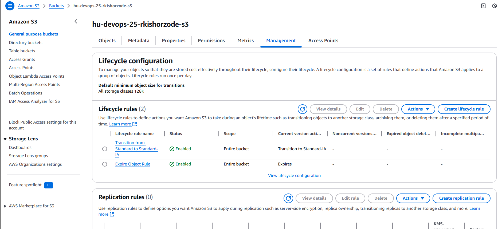

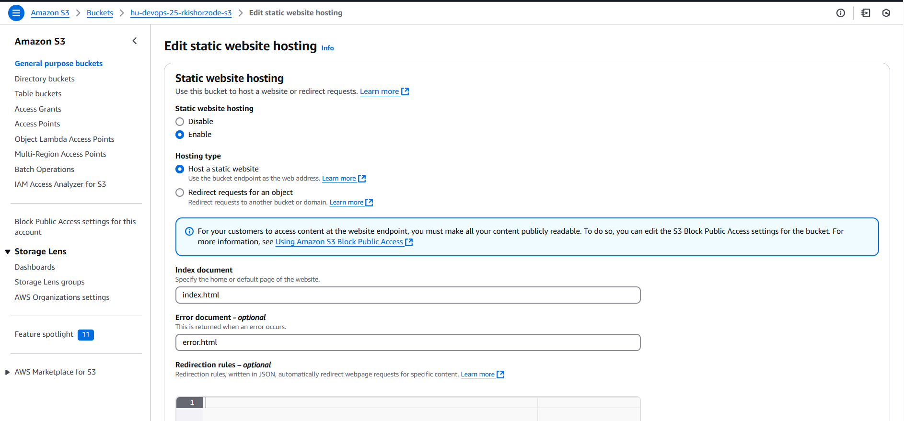

## Task 4: IAM Role attachment and Connectivity. 
- Subtask 4.1: Create a Private Instance. (Note: Choose t2. micro, Ubuntu) 
- Subtask 4.2: Create an IAM Role that can only access the S3 bucket that you have created 
in the previous question, attach the IAM role to the private instances and confirm that you 
have connectivity and push the nginx conf file to S3 via E2 machine. 

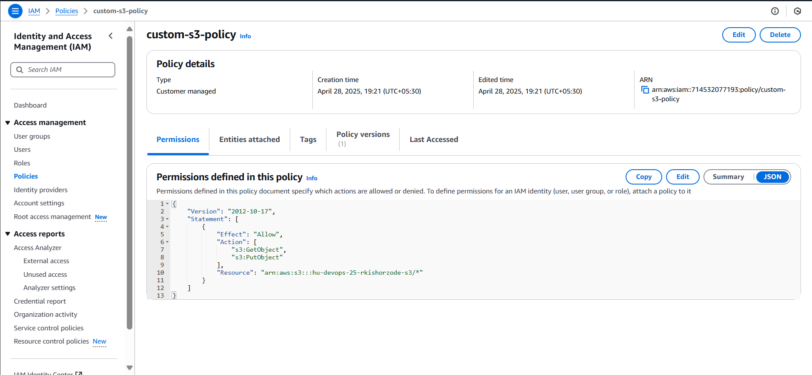

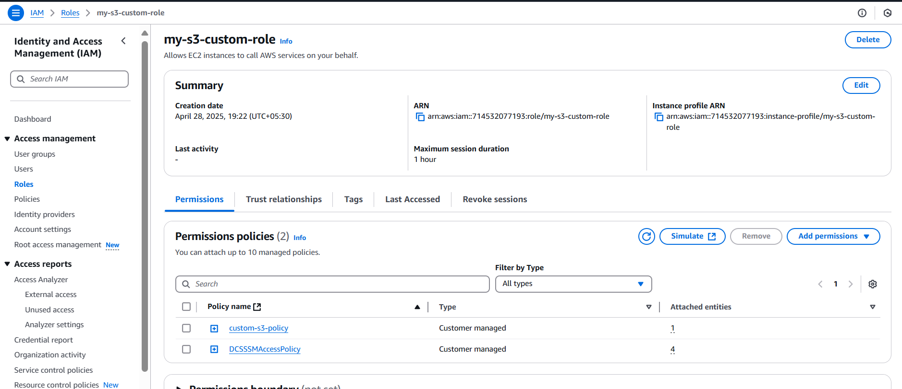

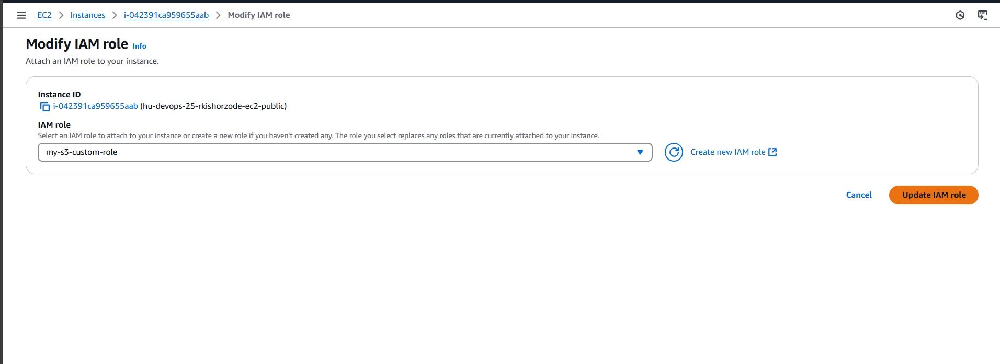

Task 5: Containerization and Content Distribution. 
- Subtask 5.1: Build a nginx Docker image, push it to Elastic Container Registry (ECR), and 
deploy the image into ECS (Elastic Container Service), exposing it via an Application Load 
Balancer. The ECS Cluster is already created in the AWS account (ecs-hu-devops). 

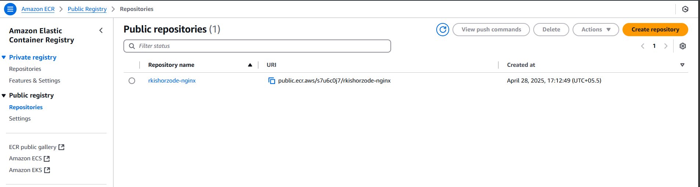

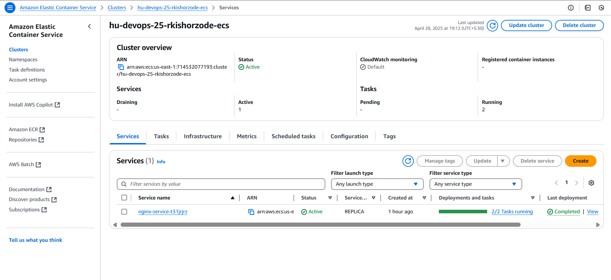

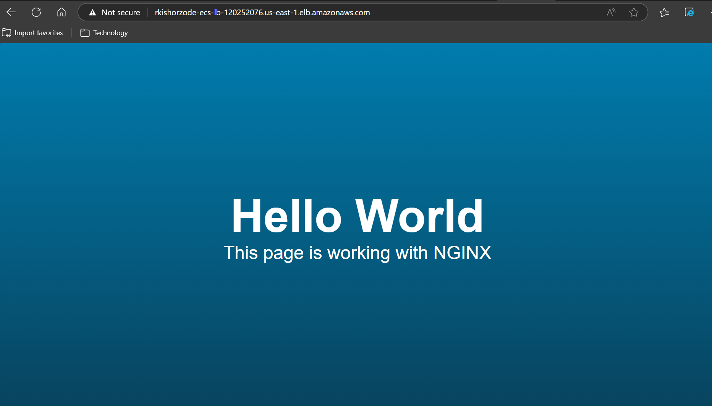

## assignment done