# Cloud Assignment DAY 1

## Task 1: EC2 and Storage Management. 
- Subtask 1.1: Launch a Private Linux EC2 instance. (Choose Ubuntu with t2. micro). 
- Subtask 1.2: Create an EBS volume with 10GB of storage, attach it to the created 
instance, and resize the volume to 15GB ensure the change reflects inside the instance. 
- Subtask 1.3: Deploy a sample nginx page in a private EC2 instance via init script and 
expose it via an Application Load Balancer

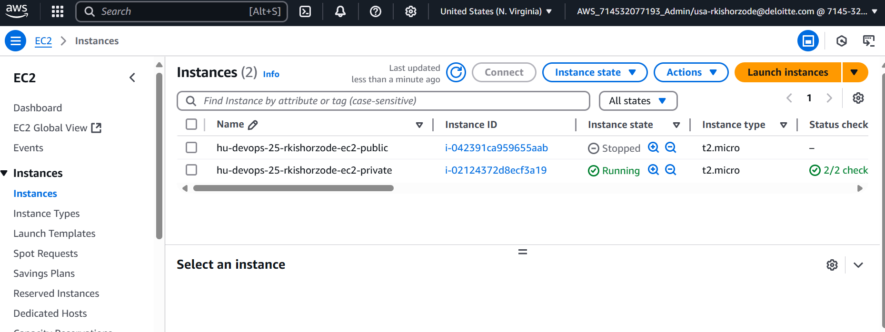


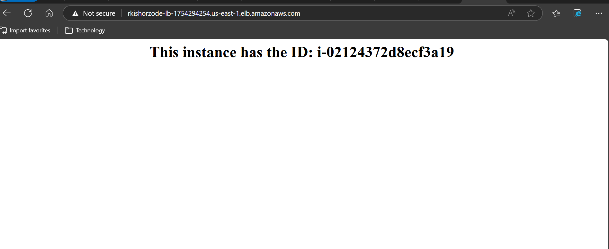

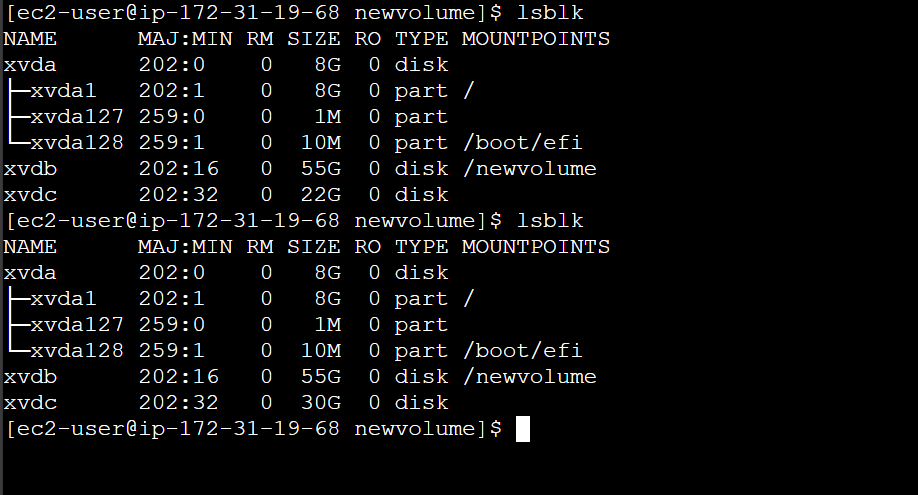


## Task 2: Serverless Architecture Setup. 
- Subtask 2.1: Create a sample Python Lambda function. 
- Subtask 2.2: Set the Lambda trigger as SQS and send a message to test the invocation. 
- Subtask 2.3: Attach the proof of lambda invocation through SQS. Attach screenshots of 
CloudWatch logs with the message from Lambda test invocation.


## Task 3: Static Website Hosting and S3 Management. 
- Subtask 3.1: Create a private S3 bucket and enable versioning to host a static website 
and upload index.html and error.html pages. Block Public access for S3 bucket.
- Subtask 3.2: Add a lifecycle rule to the bucket: Transition from Standard to Standard-IA 
in 30 days and expire objects in 200 days. Enable versioning and re-upload any 2 files to 
verify. 
- Subtask 3.3: Host the site for above S3 static website using cost effective way.


## Task 4: IAM Role attachment and Connectivity. 
- Subtask 4.1: Create a Private Instance. (Note: Choose t2. micro, Ubuntu) 
- Subtask 4.2: Create an IAM Role that can only access the S3 bucket that you have created 
in the previous question, attach the IAM role to the private instances and confirm that you 
have connectivity and push the nginx conf file to S3 via E2 machine. 


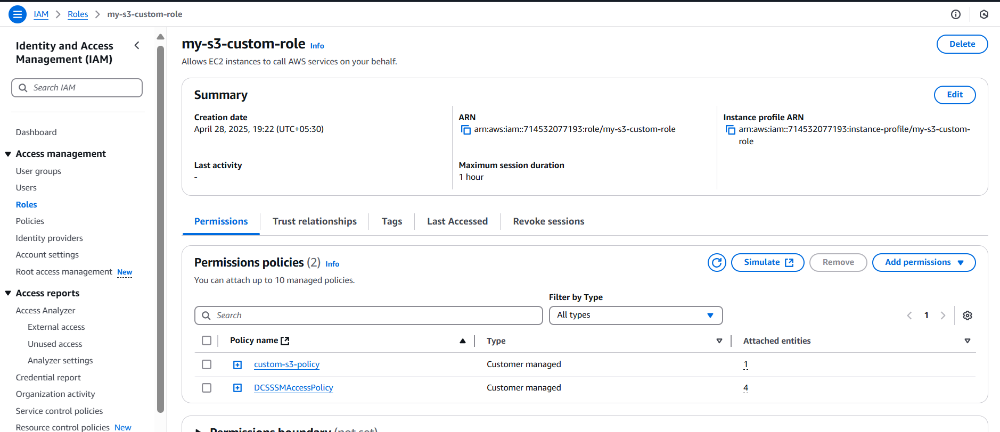


Task 5: Containerization and Content Distribution. 
- Subtask 5.1: Build a nginx Docker image, push it to Elastic Container Registry (ECR), and 
deploy the image into ECS (Elastic Container Service), exposing it via an Application Load 
Balancer. The ECS Cluster is already created in the AWS account (ecs-hu-devops). 


## assignment done

# Cloud Assignment DAY 2

## Task 1: EC2 instance and Application Load Balancer Creation with CLI
- Subtask 1.1: create an EC2 instance of type t2.micro and attach a security group rule 
to allow inbound HTTP traffic on port 80 to the EC2 instance.
- Subtask 1.2: create an Application Load Balancer (ALB) target group and configure 
another security group for the ALB to allow inbound HTTP traffic on port 80


```
aws ec2 create-security-group --group-name u-devops-25-rkishorzode-sg-allow-80 --description "Security group for web server allowing HTTP" --vpc-id vpc-040e583668e43adf1
```
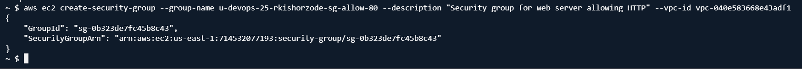

```
aws ec2 authorize-security-group-ingress --group-id sg-0b323de7fc45b8c43 --protocol tcp --port 80 --cidr 0.0.0.0/0
```
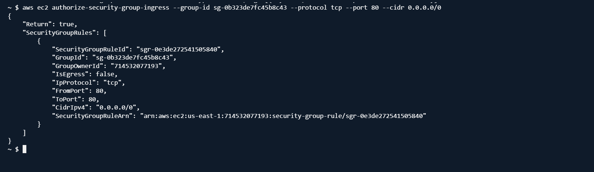

```
aws ec2 run-instances --image-id ami-0e449927258d45bc4 --count 1 --instance-type t2.micro --key-name rkishorzode-key --security-group-ids sg-0b323de7fc45b8c43 --subnet-id subnet-041b4bd98bb3fcb39 --associate-public-ip-address --tag-specifications 'ResourceType=instance,Tags=[{Key=Name,Value=hu-devops-25-rkishorzode-ec2}]'

```


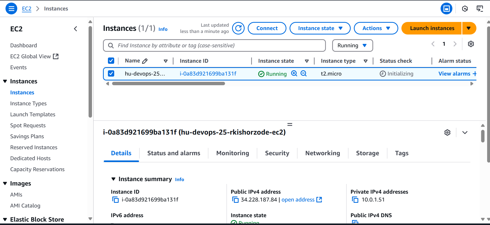

### ssh and install nginx
```
sudo yum update -y
sudo yum install nginx -y
sudo systemctl enable nginx
sudo systemctl start nginx
```


```
aws elbv2 create-target-group \
    --name hu-devops-25-rkishorzode-tg \
    --protocol HTTP \
    --port 80 \
    --vpc-id vpc-040e583668e43adf1 \
    --target-type instance

```
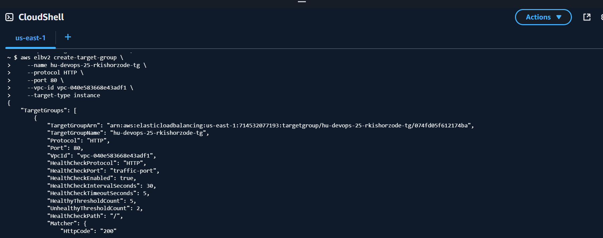

```
aws elbv2 register-targets \
    --target-group-arn arn:aws:elasticloadbalancing:us-east-1:714532077193:targetgroup/hu-devops-25-rkishorzode-tg/074fd05f612174ba \
    --targets Id=i-0a83d921699ba131f

```


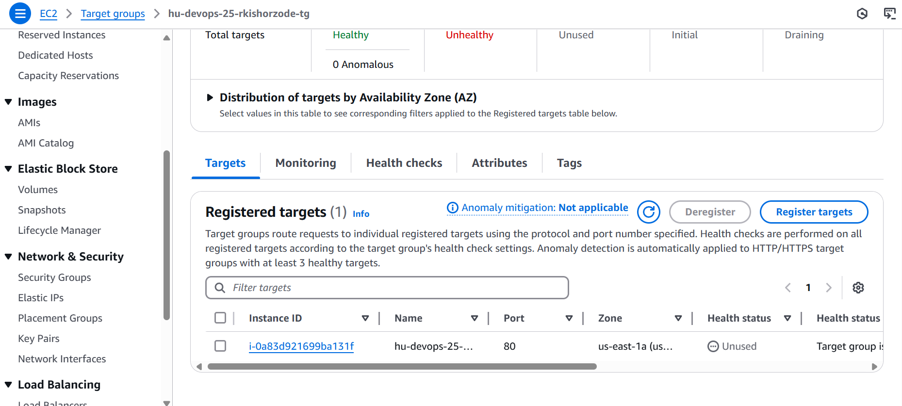

```
aws ec2 create-security-group \
    --group-name hu-devops-25-rkishorzode-alb-sg \
    --description "Security group for ALB allowing HTTP" \
    --vpc-id vpc-040e583668e43adf1
```
```
aws ec2 authorize-security-group-ingress \
    --group-id sg-0d1a769c5b7f12662 \
    --protocol tcp \
    --port 80 \
    --cidr 0.0.0.0/0
```
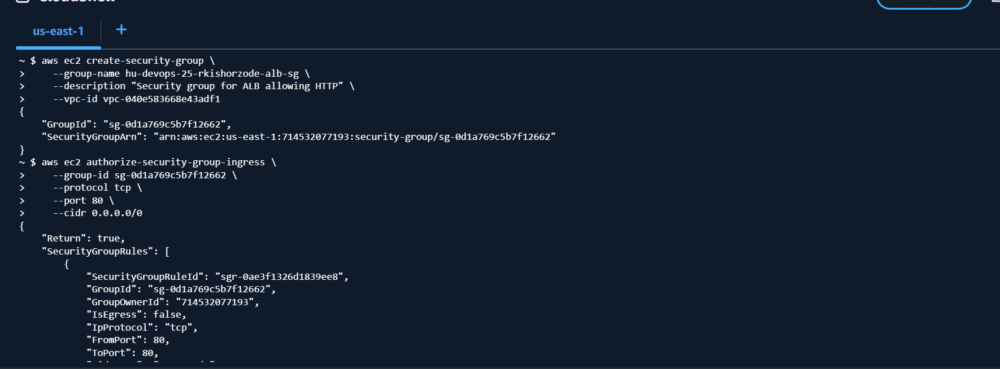

```
aws elbv2 create-load-balancer \
    --name hu-devops-25-rkishorzode-alb \
    --subnets subnet-041b4bd98bb3fcb39 subnet-07420ce3b6966f11e \
    --security-groups sg-0d1a769c5b7f12662 \
    --scheme internet-facing \
    --type application \
    --ip-address-type ipv4
```


```
aws elbv2 create-listener \
    --load-balancer-arn arn:aws:elasticloadbalancing:us-east-1:714532077193:loadbalancer/app/hu-devops-25-rkishorzode-alb/693f2a468998ed39 \
    --protocol HTTP \
    --port 80 \
    --default-actions Type=forward,TargetGroupArn=arn:aws:elasticloadbalancing:us-east-1:714532077193:targetgroup/hu-devops-25-rkishorzode-tg/074fd05f612174ba
```


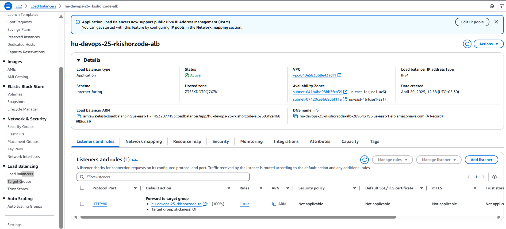

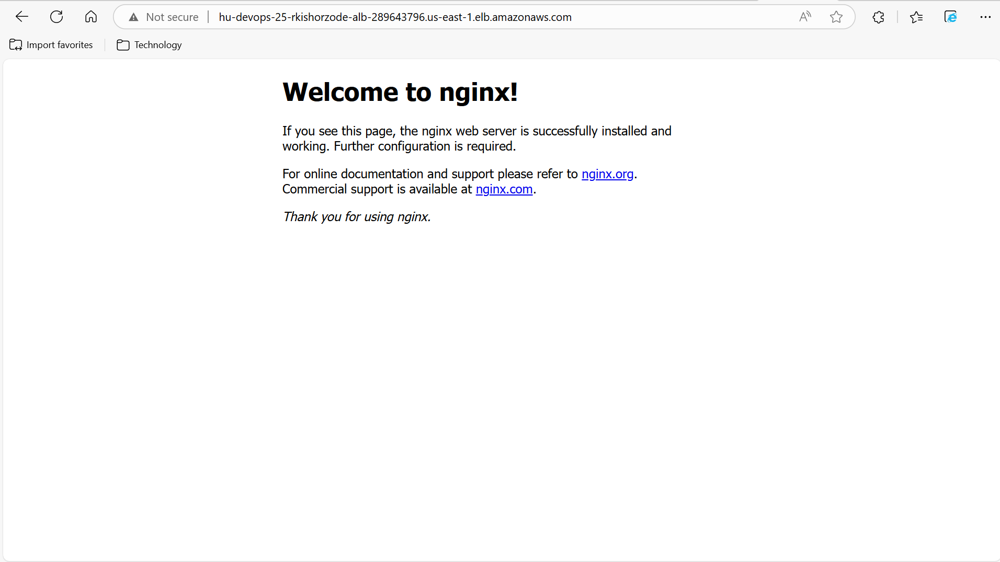


## Task 2: Create Proxy Methods with Load Balancer URL
- Subtask 2.1: Create a proxy GET and POST method using the Application Load 
Balancer URL. Ensure that the proxy is configured to route traffic through a Web 
Application Firewall (WAF) that you create. Using AWS CLI

### Create a Web Application Firewall (WAF) Web ACL
```
aws wafv2 create-web-acl \
    --name hu-devops-25-rkishorzode-web-acl \
    --scope REGIONAL \
    --default-action Allow={} \
    --visibility-config SampledRequestsEnabled=true,CloudWatchMetricsEnabled=true,MetricName=hu-devops-25-rkishorzode-web-acl \
    --region us-east-1
```
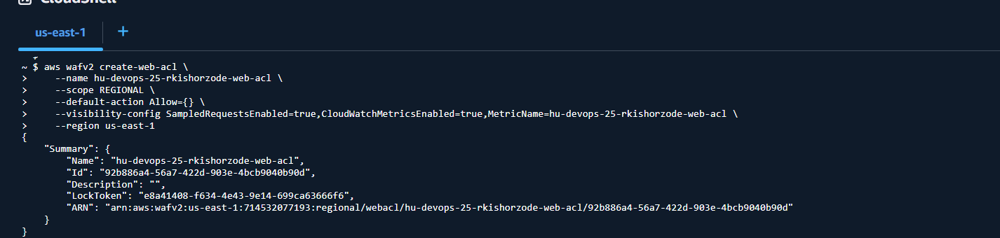

### Associate WAF Web ACL with ALB
```
aws wafv2 associate-web-acl \
    --web-acl-arn arn:aws:wafv2:us-east-1:714532077193:regional/webacl/hu-devops-25-rkishorzode-web-acl/92b886a4-56a7-422d-903e-4bcb9040b90d \
    --resource-arn arn:aws:elasticloadbalancing:us-east-1:714532077193:loadbalancer/app/hu-devops-25-rkishorzode-alb/693f2a468998ed39 \
    --region us-east-1

```

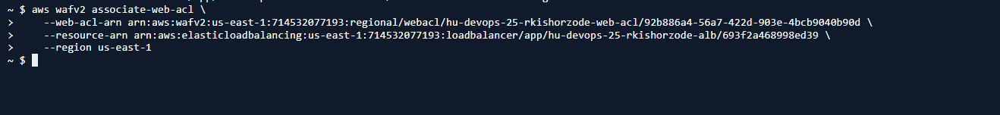

### Create api gateway

```
aws apigateway create-rest-api \
    --name 'hu-devops-25-rkishorzode-proxy-api' \
    --region us-east-1
```
```
aws apigateway get-rest-apis --region us-east-1
```
### Create Resource
- rest-api-id: Use the id from the new API (4ykgrvqtjd).
- parent-id: Use the rootResourceId from the new API (eucca6p96j).
```
aws apigateway create-resource \
    --rest-api-id ckzu8e5wme \
    --parent-id tcmg27iz65 \
    --path-part proxy \
    --region us-east-1
```
### Create GET and POST Methods
resource-id will get from create resource

```
aws apigateway put-method \
    --rest-api-id ckzu8e5wme \
    --resource-id b9n2yq \
    --http-method GET \
    --authorization-type NONE \
    --region us-east-1
```
```
aws apigateway put-method \
    --rest-api-id ckzu8e5wme \
    --resource-id b9n2yq \
    --http-method POST \
    --authorization-type NONE \
    --region us-east-1
```

### Set Integration for Methods

```
aws apigateway put-integration \
    --rest-api-id ckzu8e5wme \
    --resource-id b9n2yq \
    --http-method GET \
    --type HTTP_PROXY \
    --integration-http-method ANY \
    --uri http://hu-devops-25-rkishorzode-alb-693f2a468998ed39.us-east-1.elb.amazonaws.com \
    --region us-east-1
```
```
aws apigateway put-integration \
    --rest-api-id ckzu8e5wme \
    --resource-id b9n2yq \
    --http-method POST \
    --type HTTP_PROXY \
    --integration-http-method ANY \
    --uri http://hu-devops-25-rkishorzode-alb-693f2a468998ed39.us-east-1.elb.amazonaws.com \
    --region us-east-1
```
### Deploy
```
aws apigateway create-deployment \
    --rest-api-id ckzu8e5wme \
    --stage-name prod \
    --region us-east-1
```

Task 3: Install and Configure Kinesis Agent and NGINX
- Subtask 3.1: On the same EC2 instance, install the Kinesis Agent and NGINX. 
Configure NGINX to pass data through a Kinesis stream and direct the data to Kinesis 
Data Analytics for further analysis. Using AWS Console


```
#!/bin/bash

# Update the package repository
sudo yum update -y

# Install NGINX
sudo amazon-linux-extras install nginx1.12 -y

# Start and enable NGINX
sudo systemctl start nginx
sudo systemctl enable nginx

# Install Kinesis Agent
sudo yum install -y aws-kinesis-agent

# Configure NGINX to log requests
sudo tee /etc/nginx/nginx.conf > /dev/null <<EOL
user nginx;
worker_processes auto;
error_log /var/log/nginx/error.log;
pid /run/nginx.pid;

events {
    worker_connections 1024;
}

http {
    log_format main '\$remote_addr - \$remote_user [\$time_local] "\$request" '
                    '\$status \$body_bytes_sent "\$http_referer" '
                    '"\$http_user_agent" "\$http_x_forwarded_for"';
    access_log /var/log/nginx/access.log main;

    include /etc/nginx/mime.types;
    default_type application/octet-stream;

    sendfile on;
    keepalive_timeout 65;

    include /etc/nginx/conf.d/*.conf;
}
EOL

# Restart NGINX to apply changes
sudo systemctl restart nginx

# Create Kinesis Agent configuration
sudo tee /etc/aws-kinesis/agent.json > /dev/null <<EOL
{
  "cloudwatch.emitMetrics": true,
  "kinesis.endpoint": "kinesis.us-east-1.amazonaws.com",
  "firehose.endpoint": "firehose.us-east-1.amazonaws.com",
  "flows": [
    {
      "filePattern": "/var/log/nginx/access.log*",
      "kinesisStream": "hu-devops-25-rkishorzode-kinesis",
      "dataProcessingOptions": [
        {
          "optionName": "LOGTOJSON",
          "logFormat": "NGINX"
        }
      ]
    }
  ]
}
EOL

# Start and enable the Kinesis Agent
sudo systemctl start aws-kinesis-agent
sudo systemctl enable aws-kinesis-agent

```


## Task 4: S3 & IAM Creation. 
- Subtask 4.1: Create a S3 bucket with CORS policy, public access blocked and add 
lifecycle rule to the bucket: The objects will be moved to the Amazon S3 Glacier 
storage class in 90 days after creation using AWS CLI. 
- Subtask 4.2: Create an IAM role with the Policy which will list the objects in the S3 
bucket which has been created in the previous step and attach that role to the EC2 
instances using AWS CLI

```
aws s3api create-bucket \
    --bucket hu-devops-25-rkishorzode-s3 \
    --region us-east-1
```
```
aws s3api put-bucket-cors \
    --bucket hu-devops-25-rkishorzode-s3 \
    --cors-configuration file://cors.json
```
```
aws s3api put-public-access-block \
    --bucket hu-devops-25-rkishorzode-s3 \
    --public-access-block-configuration BlockPublicAcls=true,IgnorePublicAcls=true,BlockPublicPolicy=true,RestrictPublicBuckets=true
```
```
aws s3api put-bucket-lifecycle-configuration \
    --bucket hu-devops-25-rkishorzode-s3 \
    --lifecycle-configuration file://lifecycle.json
```
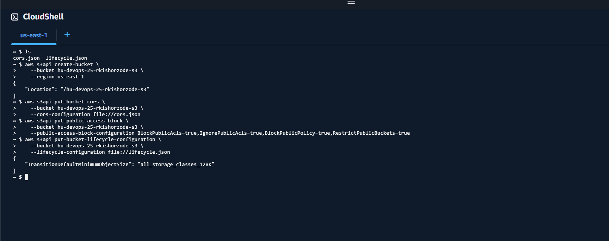

- S3 Bucket Created: hu-devops-25-rkishorzode-s3
- CORS Policy: Allows GET requests from any origin.
- Public Access Blocked: Ensures the bucket is not publicly accessible.
- Lifecycle Rule: Moves objects to Glacier after 90 days.

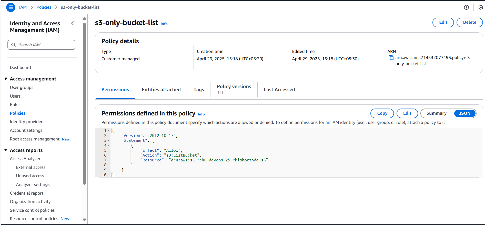

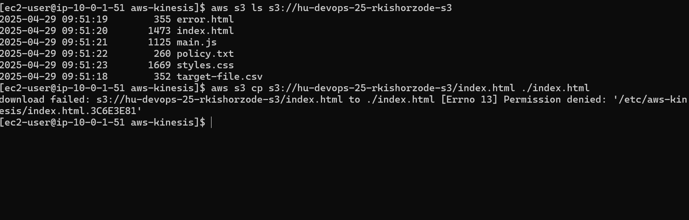

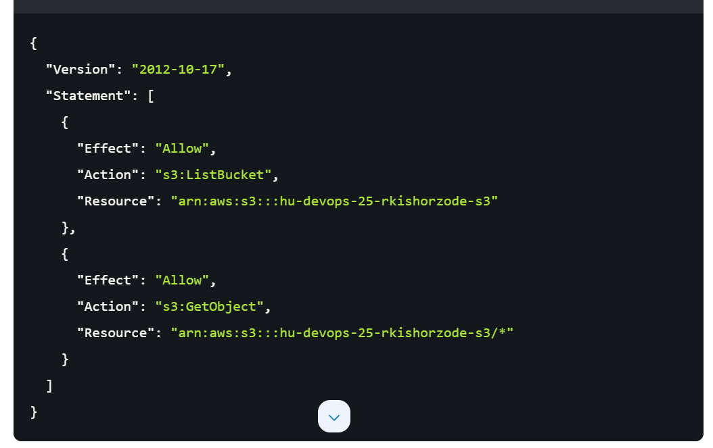

- Create IAM Role: Create an IAM role with a policy that lists objects in the S3 bucket.
- Attach Role to EC2: Attach the created IAM role to the EC2 instance using AWS CLI.
- Access Bucket: The policy allows listing objects in the bucket hu-devops-25-rkishorzode-s3.
- Restrict Object Access: The policy does not allow access to the objects themselves.


## Task 5: Deploy Docker Application on App Runner and Configure Auto Scaling for App 
Runner Service
- Subtask 5.1: Using AWS CLI, create and deploy a Docker application on AWS App 
Runner. For configuring the App Runner service, use a YAML configuration file.
- Subtask 5.2: Configure auto scaling for the App Runner service created, setting the 
minimum number of instances to 1 and the maximum number of instances to 2


file: apprunner-config.json
```
aws apprunner create-service --cli-input-json file://apprunner-config.json
```

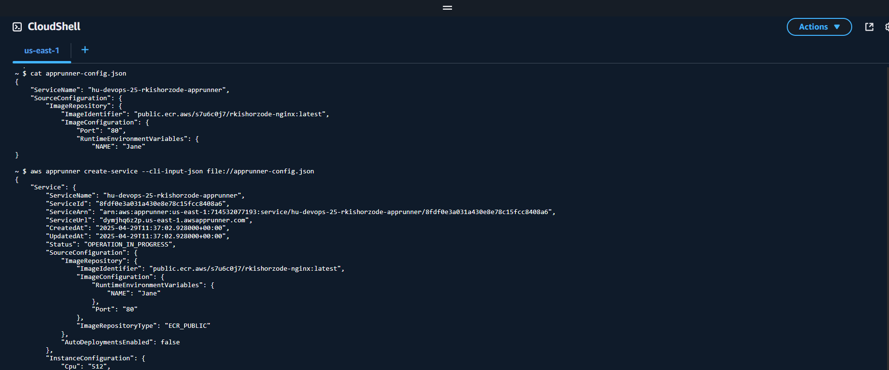


```
aws apprunner create-auto-scaling-configuration \
    --auto-scaling-configuration-name my-auto-scaling-config \
    --max-concurrency 100 \
    --min-size 1 \
    --max-size 2
```
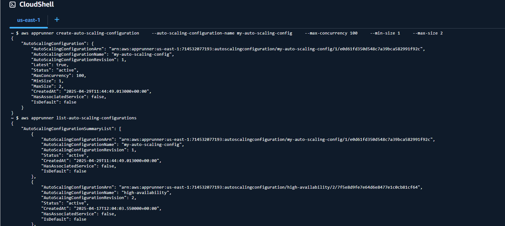


```
aws apprunner update-service \
    --service-arn arn:aws:apprunner:us-east-1:714532077193:service/hu-devops-25-rkishorzode-apprunner/8fdf0e3a031a430e8e78c15fcc8408a6 \
    --auto-scaling-configuration-arn arn:aws:apprunner:us-east-1:714532077193:autoscalingconfiguration/my-auto-scaling-config/1/e0d61fd350d548c7a39bca582991f92c
```

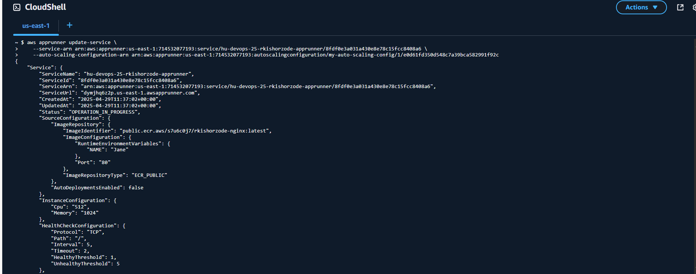

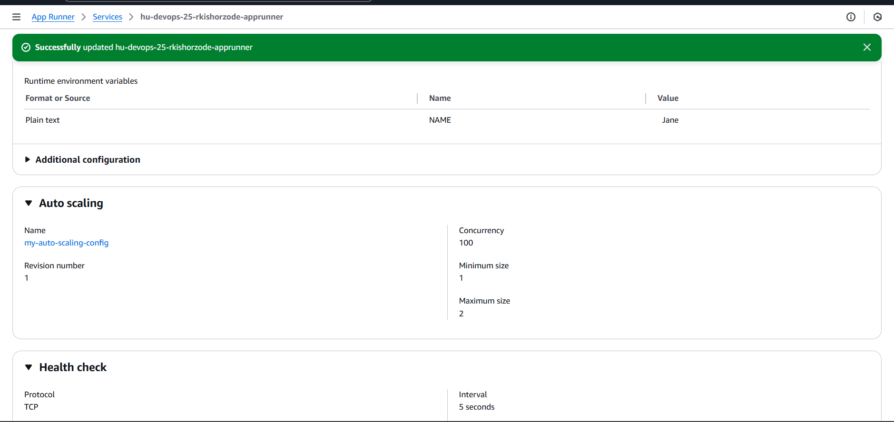

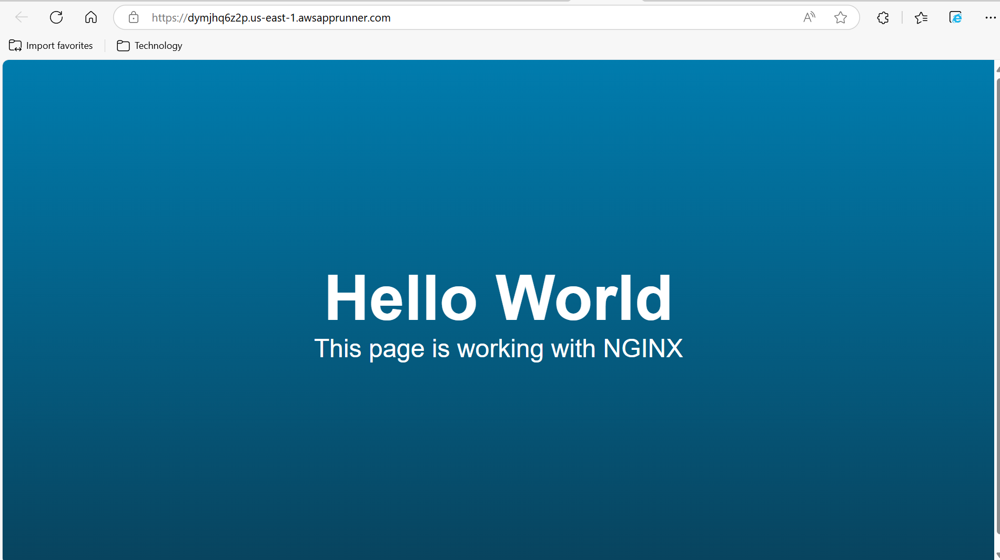