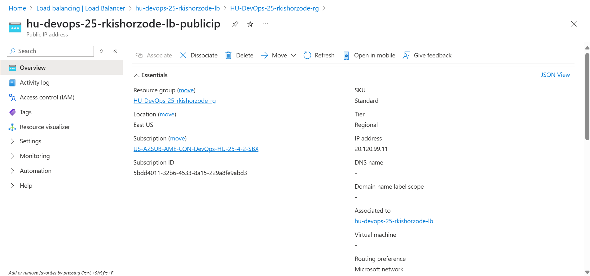

# Cloud Assignment DAY 1

## Question:1

A. Create a Private Virtual Machine. The resource should follow the naming 
convention “hu-devops-25-{Linker_Name}-{Resource_Name}”. It should have the 
following configurations: 
 
- Image: Ubuntu 22.xxxlts or 24 
- Size: Standard_B1s 
- Disk : Standard ssd 
- Authentication Type: Password 
- Username: YourName 
- Pass a cloud-init script that installs and starts the service apache2 with 
custom webpage. 
Expectation: Attach screenshots for the following: 
 Virtual Machine Overview 
 Cloud-init file 
 SSH into the Machine and view the contents of /var/log/cloud-init-output.log 
file 
 Custom webpage 

B. Create and attach a Managed Disk of 4 GB to previously created Virtual 
Machine and mount it to the VM. 
Expectation: Attach screenshots for the following: 
Run the command “lsblk” before attaching the disk to the Virtual Machine 
Run the command “lsblk” after attaching the disk to the Virtual Machine 
Commands to mount the ext4 filesystem on the new disk (Entire Process should 
be captured)
C. Create a Snapshot of this VM for Next task, Once Snapshot is created delete the 
VM created which you have been created as part of this question. 
D. Create a new VM using previously created snapshot and verify it is using 
custom webpage. (Screen shot to be captured on browser/curl request)

## Question:2

Create a Virtual Machine Scale Set. The resource should follow the naming 
convention “hu-devops-25-{Linker_Name}-{Resource_Name}”. It should have the 
following configurations 
- Image : Ubuntu 22.xxxlts or 24
- Size : Standard_B1s
- Authentication Type : SSH Public Key
- Username : YourName
- Enable boot diagnostics through hubucket2025 Storage account with the 
naming convention “yournamehu25”.
- Initial Count :2 , Minimum Count : 1 and Maximum Count 3
- Scale based on cpu utilization if it crossing 70%
- Install Apache with custom index page
Expectation: Attach screenshots for the following: 
Virtual Machine Scale Set overview 
Azure Monitor for the Virtual Machine Scale Set 
Storage Account with boot diagnostics 
Cloud-init file 
Screen shot on scaling 

## Question:3
Create a Standard Load Balancer. The resource should follow the naming 
convention “hu-devops-25-{Linker_Name}-{Resource_Name}”. 
It must serve traffic to the previously created Virtual Machine Scale Set on Port 
80. Configure the Load Balancer accordingly.
Expectation: Attach screenshots for the following: 
Load Balancer Overview 
Backend Pools 
Load Balancer rules 
Outbound rules 
Health Probes 
Load Balancer IP 
Web page on Load Balancer IP 

## Question:4
Use Azure container registry named (huregistry) create your own repository by 
the name (Deloitte_Username-nginx) and push your custom docker image with 
the tag :v1 
Create a web app in Azure App Service with a previously pushed Docker 
image in registry (huregistry) and with standard configuration.
Expectation: Attach screenshots for the following: 
- Web App overview 
- Nginx homepage 

## Question:5
Create a Storage Account “hudevops25{Linker_Name}{Resource_Name}”, provision a static 
website hosting facility. and enable Azure Front door. 
Expectation: Attach screenshots for the following: 
Storage account blob overview 
Index Document 
Error Document 
Blob endpoint on Browser 
Create a Lifecyle policy to move objects to cool storage after 30 days

## # Cloud Assignment DAY 1

## Question:1

A. Write a python script using SDKs to create a storage account and a 
container in azure blob storage .

B. Write a PowerShell script to list all the Vnet and their subnets that is 
present in a subscription and save the output in csv to a file named 
YourName_sub_Vnet.csv and push it to container which you created 
previously (Use Azure Cloud CLI) (Don’t use azure portal for uploading 
the file)

## Question:2

 Write a python script to Deploy a Azure Container App 
- Create your own repository under (HUDevOpsRegistry) registry (ACR)
and push your custom nginx docker image. (Don’t create any new ACR)
- Write python script for creating a azure container app with in the 
container app environment ( HU-DevOps-25-CAE , with cpu 0.25 --
memory 0.5Gi)
- Verify the azure container app you created by hitting its URL in the 
browser and capture the screen shot.

## Question:3

 Write a python script to create an app service plan. (SKU – B1)
- Write a script to create a Linux and python based webapp in the app service plan 
(SKU_B1)that you created. 
- Use this repository - https://github.com/Azure-Samples/python-docs-hello-world
Leverage the python script to deploy this code directly from to the webapp that 
you created. 
- Confirm the app service you created by hitting the endpoint in the browser and 
capture the screen shot .

## Question:4

 Setup and Automate Azure Storage and Function App using Azure Bicep 
- Use Azure Bicep to create a Storage Account with Standard_LRS SKU. 
- Add two containers named container-a and container-b in the Storage 
Account. 
- Deploy a Function App using the Consumption Plan (Y1 SKU) via Bicep. 
- Upload 2 files named file1.txt and file2.txt to container-a. 
- Write a Python script to transfer the file1.txt s from container-a to container-b. 
- Deploy the Python script to the Function App and run the python script to 
transfer the file1.txt file to container-b. 
- Tag all the resources with the mentioned format 
- Use Parameters, variables , modules 

## Question:5

- Write a python script to delete all the files and the container, storage account, 
webapp , app service plans all other resources which is associated with your Tags.

## Assignmnet Done