# Cloud Assignment DAY 1

## Question:1

1. Orchestrate a Data Workflow using Cloud Composer and BigQuery
• Objective: Automate and manage complex data workflows.
• Steps:
a. Create a Cloud Composer environment to manage the workflow.
b. Write a Directed Acyclic Graph (DAG) to automate the following steps:
i. Load data from a Cloud Storage bucket into a BigQuery table.
ii. Run a BigQuery query to transform the data which is already present in 
the cloud.
iii. Export the results to another Cloud Storage bucket.
c. Schedule the DAG to run daily and verify the successful executon

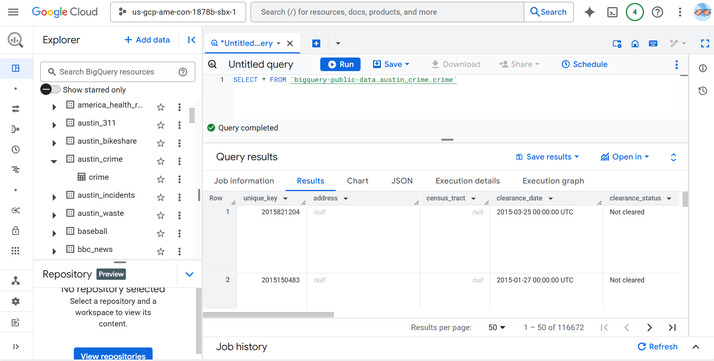

## Question:2

C2. Integrate Google Cloud Storage (GCS) with Google Cloud CDN to serve static content efficiently.
• Objective: Set up Google Cloud CDN to cache and serve static content from a Google Cloud 
Storage bucket, improving content delivery performance.
• Steps:
1. Create a Google Cloud Storage Bucket:
- Create a GCS bucket to store your static content.
- Upload some sample static files (e.g., images, HTML, CSS) to the bucket.
2. Configure Bucket Permissions:
- Set the appropriate IAM roles to allow public access to the bucket.
3. Set Up a Load Balancer:
- Create a global HTTP(S) load balancer in Google Cloud.
4. Enable Cloud CDN:
- Configure caching policies to optimize content delivery.
5. Test the Setup:
- Access the static content via the CDN URL and verify that it is being served 
correctly

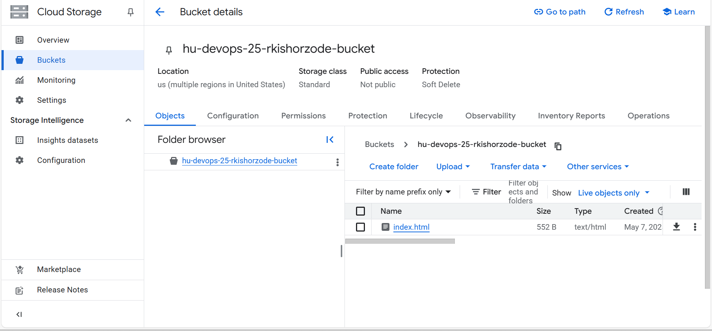


## Question:3
3. Create a Cloud Func@on to list down the current working directory using the os module and print 
the @me using Cloud Scheduler at an interval of 1 minute.
• Objective: Automate the execution of a Cloud Function that lists the current working directory 
and prints the current time at regular intervals.
• Steps:
a. Create the Cloud Function:
i. Write a Python Cloud Function that uses the os module to list the current 
working directory and prints the current time.
ii. Deploy the Cloud Function to GCP.
b. Set Up Cloud Scheduler:
i. Create a Cloud Scheduler job to trigger the Cloud Function every 1 minute.
ii. Ensure the necessary permissions are set up for Cloud Scheduler to invoke the 
Cloud Function.
c. Verify the Setup:
i. Monitor the Cloud Function logs to ensure it is being triggered every minute and 
is printing the desired output

```
python

import os
from datetime import datetime

def list_directory_and_time(request):
    # List the current working directory
    cwd = os.getcwd()
    
    # Get the current time
    current_time = datetime.now().strftime("%Y-%m-%d %H:%M:%S")
    
    # Print the results
    print(f"Current Working Directory: {cwd}")
    print(f"Current Time: {current_time}")
    
    return f"Current Working Directory: {cwd}\nCurrent Time: {current_time}"

```

add this code in cloud function 

## Question:4

4. Create a custom Instance Template using gcloud with all the details below-: 
a. Name-: YOUR_FIRSTNAME-hudevops 
b. Boot Disk Size-: t GB 
c. Image Family-: debian-10 
d. Machine Type-: n1-standard-1 
e. Image Project-: Debian-cloud
f. Take the screenshot of this once created and delete the resource.

note - Disk size cannot be smaller than the size of chosen disk image (10GB)

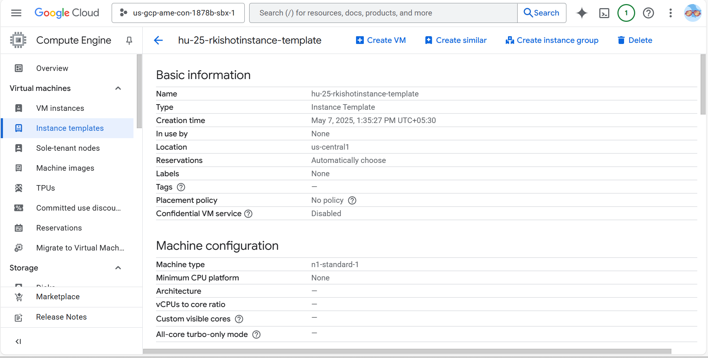

## Question:5

5. Implement an Event-Driven Architecture with Cloud Pub/Sub and Cloud Storage
• Objectve: Automate file processing based on events.
• Steps:
a. Create a Pub/Sub topic to receive event notficatons from Cloud Storage.
b. Enable event notificatons on a Cloud Storage bucket to trigger the Pub/Sub 
topic when a new file is uploaded.
c. Write a Cloud Functon that triggers on Pub/Sub messages and processes the 
uploaded file (e.g., image resizing).
d. Upload a file to the bucket and verify that the event-driven workflow is 
executed

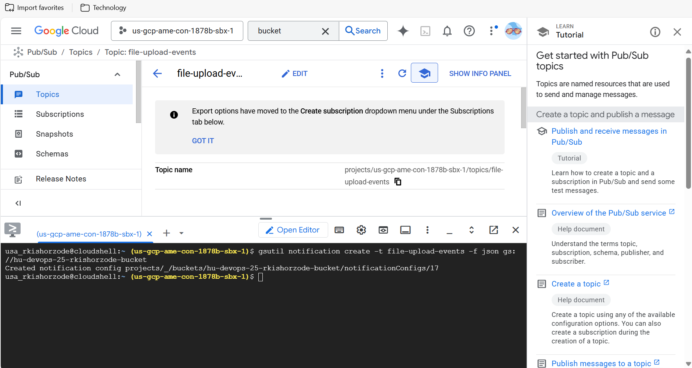


# Cloud Assignment DAY 2


1. Cloud Run with Custom Docker Image:
• Objective: Deploy a custom Docker image to Cloud Run using Google Container 
Registry (GCR).
• Steps:
a. Clone the repository from https://github.com/Deloitte-US/HU_24_DevOps_Sample_Application.
b. Build a Docker image from the provided code.
c. Push the Docker image to your GCR repository.
d. Deploy the Docker image to Cloud Run using the cli command.
e. Expose the application using load balancer.
f. Verify the deployment by accessing the LB UR


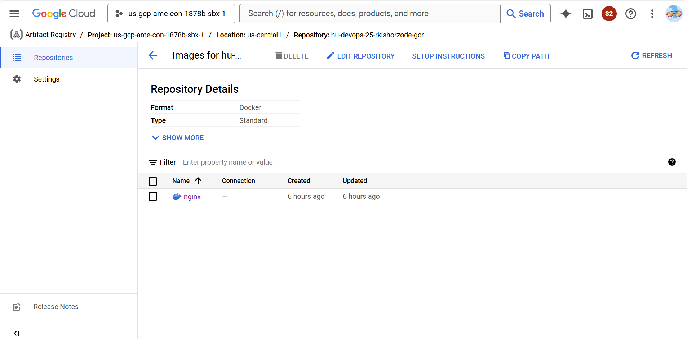

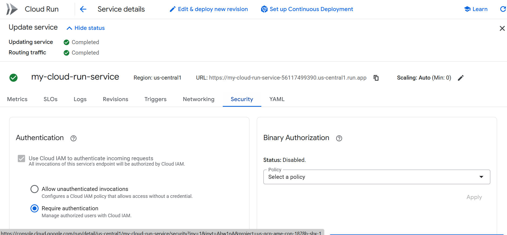

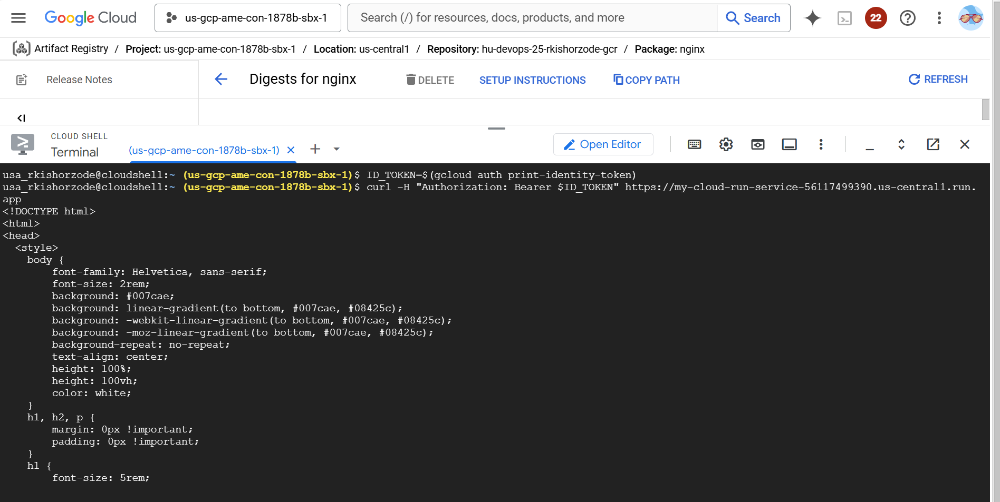

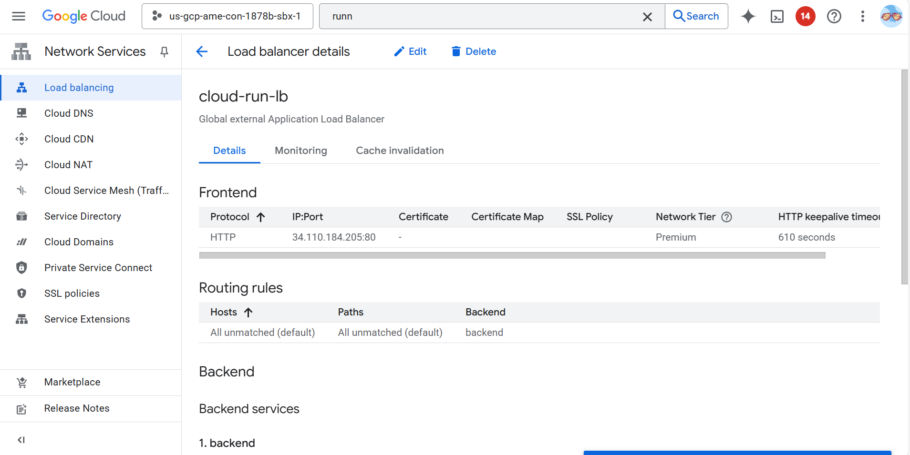

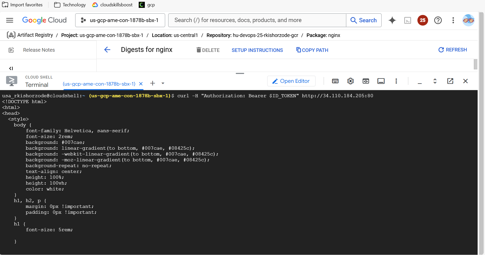


2. Cloud Function with API Gateway Integration:
• Objective: Create a simple "Hello World" Cloud Function and integrate it with an API 
Gateway.
• Steps:
a. Create a new Cloud Function in GCP with a "Hello World" response.
b. Set up an API Gateway and create an API config to route requests to the Cloud 
Function.
c. Assign the necessary IAM roles to the Cloud Function and API Gateway.
d. Deploy the API Gateway and test the integration by sending a request to the API 
Gateway endpoint

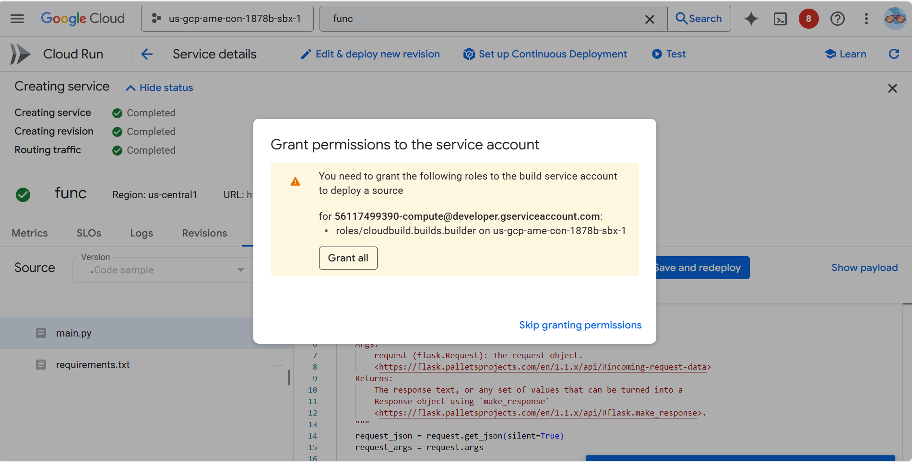

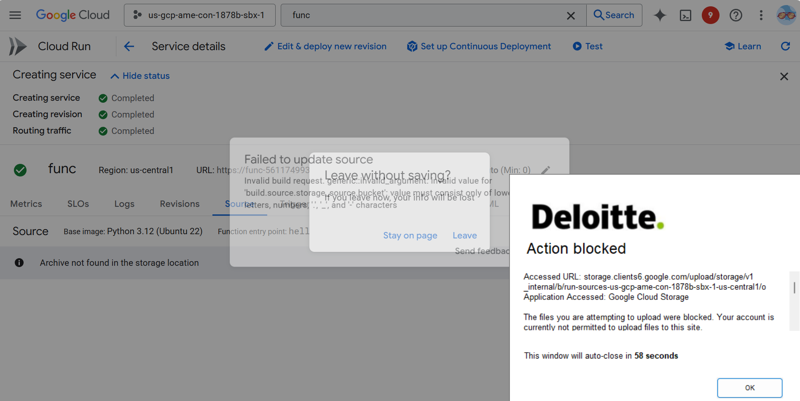


3. Deploying a Two-Tier Application:
• Objective: Deploy a two-tier application on GCP, exposing it via a load balancer.
• Steps:
a. Set up a backend service (e.g., a database) on GCP. 
b. Set up a frontend service (e.g., a web server) on GCP. 
c. Configure a load balancer to distribute traffic between the frontend instances. 
d. Set up firewall rules to allow traffic to the load balancer and between the 
frontend and backend services. 
e. Test the deployment by accessing the application through the load balancer's IP 
address or URL

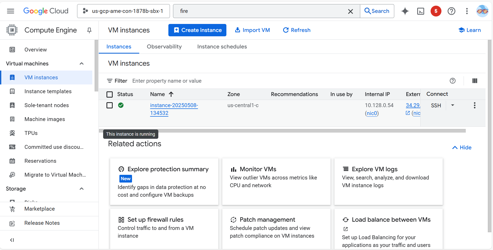

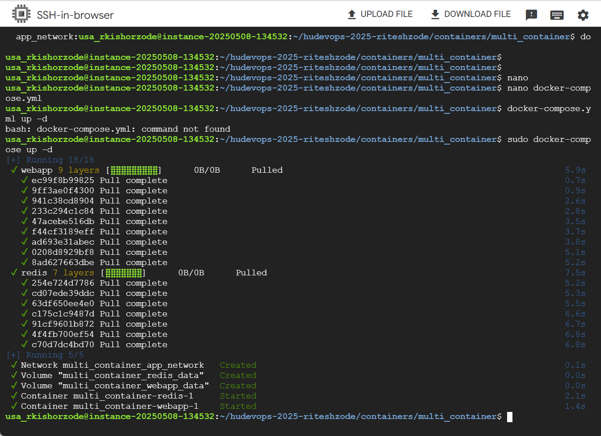

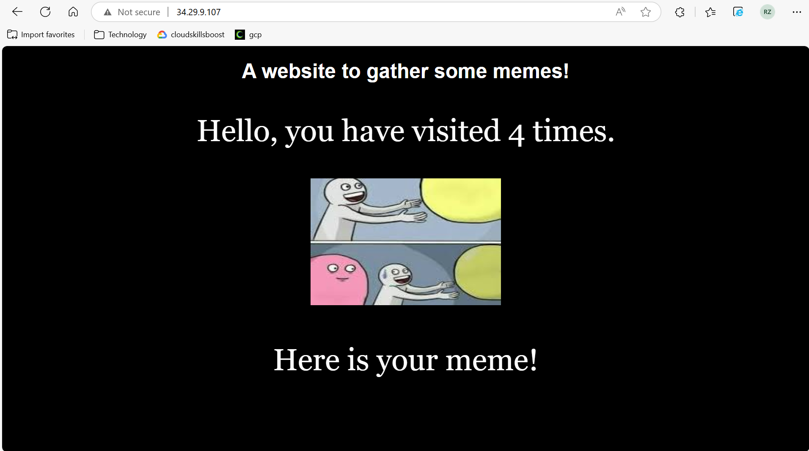

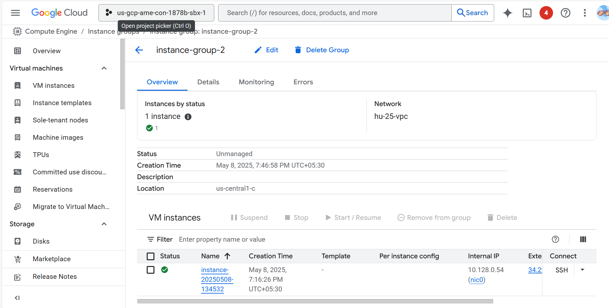

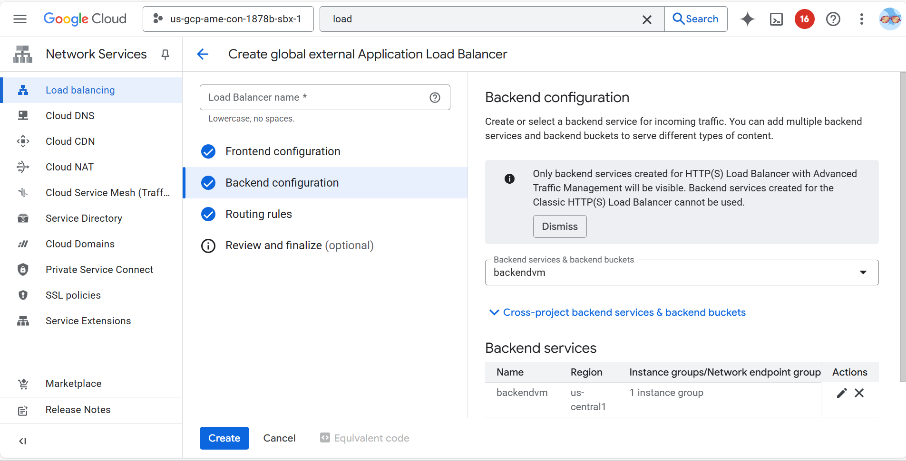

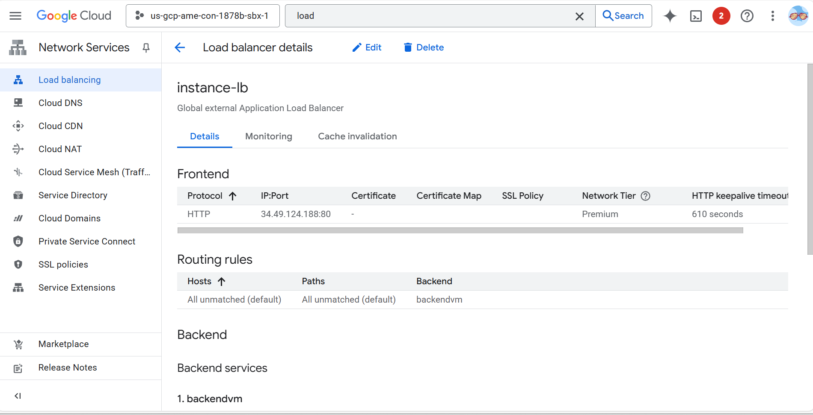

