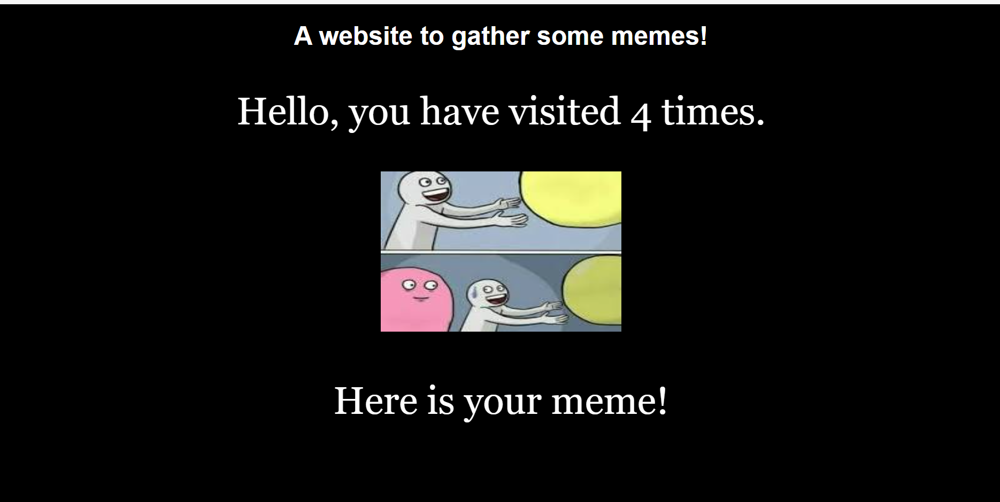

## Containerization & Virtualization track


Q1 . Simulating Storage Virtualization with Loop Devices on WSL
(checking data persistence)

```
docker volume craete test

# create first container
docker run -v test:/bin -d -p 80:80 --name ng1 nginx

# exec and create file.txt in bin
docker exec -it ng1 bash
touch bin/file.txt
exit

docker rm -f  ng1

# create second conatainer
docker run -v test:/bin -d -p 80:80 --name ng2 nginx

# exec and check file.txt in bin
docker exec -it ng1 bash
cd bin
ls file.txt
exit

```

2Q. Install buildah and containerd. and run nginx image with custom index.html

code foulder: nginx_app


3Q. Containerizing a two-tier application using PODMAN (FLASK APP and 
MySQL DB)

code foulder: todoapp

code written -- craeted Dockerfile and composefile but app is not working

4Q. Set up a multi-container application using Podman Compose

code foulder: multi_container

volume and network is is also done in nginx app 
numbers are store in redis and also it is persistent



5Q. Containerizing React App and hosting with NGINX. 
Code foulder: react-app
 


### Assignment Done