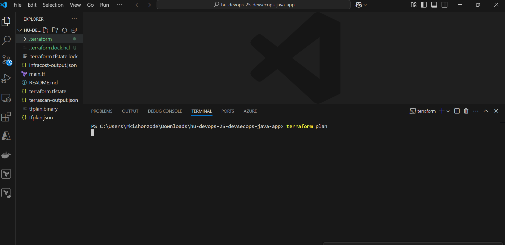
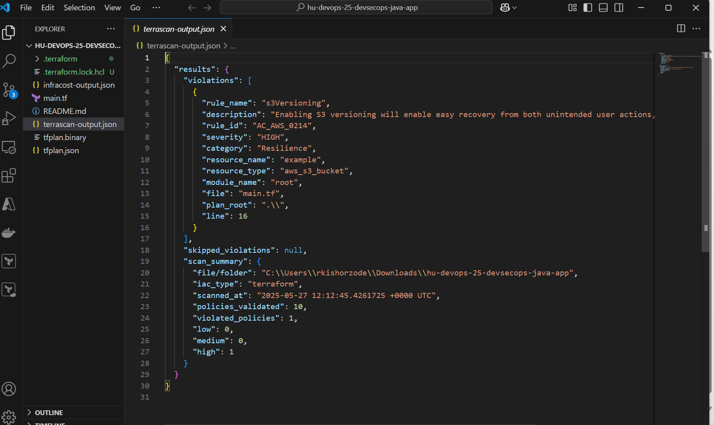

## DevSecOps

Q1. Comprehensive Security Pipeline for a Java Application
Objective:
Implement a comprehensive security pipeline for a Java application using GitHub Actions.
Tasks:
You are tasked with setting up a comprehensive security pipeline for a Java application. 
Follow the steps below to achieve this:
1. Setup Repository:
o Create a GitHub repository for this task.
o Do not work on the main branch.
o Create a branch named feature-1 and work on this branch for this question.
o Create an S3 bucket to store the scan reports.
2. Version Control:
o Use Git for version control.
HU DevOps 25.4.2 HashedIn University
2
o Create .gitignore file and ensure unnecessary files are listed for best 
practices.
3. GitHub Actions Workflow:
o Create a GitHub Actions workflow for the repository.
o Add build, static code analysis, dependency scanning, and container 
security steps into the workflow.
4. Build Stage:
o Add a build stage for the Maven application.
5. Static Code Analysis:
o Integrate a static code analysis job using SonarQube.
SonarQube Link: - Log in - SonarQube (HashedIn SonarQube Portal)
6. Dependency Scanning:
o Integrate a dependency scanning job using OWASP Dependency-Check.
o https://github.com/jeremylong/DependencyCheck/releases/
o Save the scan output in a file.
7. Container Security:
o Create a Docker file for the application.
o Build a Docker image for the application and scan it using Aqua Security's 
Trivy.
o https://hub.docker.com/r/aquasec/trivy/
o Save the scan output in a file.
8. S3 Bucket:
o Upload the scan reports of the OWASP Dependency-Check and Aqua 
Security's Trivy to the S3 bucket.
Follow-Up Questions:
• Provide Docker file for Java application.
• Create GitHub Actions workflow for security pipeline.
HU DevOps 25.4.2 HashedIn University

```
https://github.com/riteshzode18/hu-devops-25-devsecops-assignment/tree/feature-1
```

```
action
https://github.com/riteshzode18/hu-devops-25-devsecops-assignment/actions/runs/15277042714

```


Q2. Secure S3 Bucket Configuration
Objective:
Ensure that S3 buckets are configured securely by preventing public access and enabling 
encryption. Configure S3 buckets securely using Terraform and integrate security checks 
into the GitHub Actions pipeline.
Tasks:
You are tasked with creating a secure S3 bucket configuration and integrating security 
checks into a GitHub Actions pipeline. Follow the steps below to achieve this:
1. Create a New GitHub Repository:
o Do not create a new repository.
o Use the repository created in the 1st question.
o Create a branch named feature-2 and work on this branch for this question.
2. Write Terraform Scripts:
o Write Terraform scripts to create an S3 bucket with the following security 
measures: 
 The bucket should not be publicly accessible.
 Server-side encryption should be enabled.
3. Create a GitHub Actions Workflow:
o Create a GitHub Actions workflow to: 
 Run Checkov to scan Terraform scripts for security issues and store 
the output in a file.
o https://www.checkov.io/2.Basics/Installing%20Checkov.html#instal
l-from-pypi-using-pip
 Run TfLint to validate Terraform scripts for best practices and store 
the output in a file.
o https://spacelift.io/blog/what-is-tflint#how-to-install-tflint
 Upload the Checkov and TfLint scan reports to an AWS S3 bucket.
Follow-Up Questions:
• Provide Terraform script for secure S3 bucket.
• Create GitHub Actions workflow for security checks.
HU DevOps 25.4.2 HashedIn University
4


```
https://github.com/riteshzode18/hu-devops-25-devsecops-assignment/tree/feature-2

```

```
action
https://github.com/riteshzode18/hu-devops-25-devsecops-assignment/actions/runs/15276652823
```


<!--  -->


Q3. Secure Terraform Config Using Terrascan and Infracost
Objective:
Create Terraform scripts for an S3 Bucket and validate the Terraform configuration using 
Terrascan and Infracost tools. Save the Terrascan and Infracost outputs to files.
Tasks:
You are tasked with manually validating a Terraform configuration. Follow the steps below 
to ensure that the Terraform configuration is validated and cost-estimated:
1. Terraform Script:
o Use the Terraform script to create an S3 bucket.
2. Terrascan Integration:
o Integrate Terrascan to scan the Terraform configuration for security 
vulnerabilities.
o https://spacelift.io/blog/what-is-terrascan#how-to-install-terrascan
3. Infracost Integration:
o Integrate Infracost to estimate the cost of the Terraform resources.
o https://login.infracost.io
o https://github.com/infracost/infracost/releases/
4. Process:
o Validate the Terraform configuration.
o Run Terrascan to scan for security issues.
o Run Infracost to estimate costs.
o Save the Terrascan and Infracost outputs to files.
HU DevOps 25.4.2 HashedIn University
5
Follow-Up Questions:
• Provide Terraform script for S3 bucket.
• Create Terrascan integration steps

```
https://github.com/riteshzode18/hu-devops-25-devsecops-assignment/tree/feature-3
```





