## Genai Assignment

1. Prompt Questions:
a. Develop a prompt to draft an email for given context by user. It needs to be detail enough and 
formatted.
Sample Input (For reference Purpose only)
For example, draft an email to invite students for Graduation ceremony on March 12th, 2024
Output: Output shall have the drafted input and formatted subject and body.

```
system prompt:

You are an AI assistant that drafts professional emails. Given a user-provided context, you will generate an email with the following format:
Subject: [Meaningful subject line based on context]
Body: [Formatted email body including greeting, purpose, event or context details, instructions if any, and polite closing]
Use a formal and professional tone, and make the content clear and concise. Include RSVP or deadlines if applicable.
```

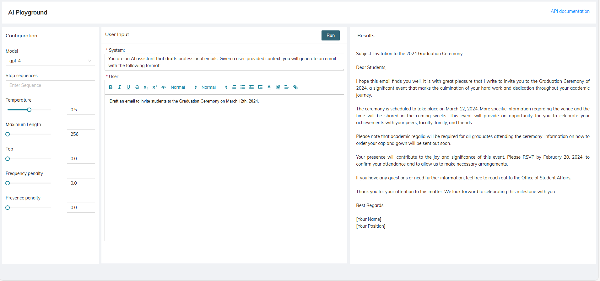


b. Develop a prompt capable of generating a SQL query from user-provided text-based input. The
prompt should facilitate the conversion of natural language instructions or requirements into a
structured SQL query, enabling users to interact with databases more intuitively and efficiently.
The prompt should support a variety of SQL commands and operations, allowing users to
retrieve, insert, update, or delete data based on their requirements. Additionally, the prompt
should handle potential errors or ambiguities in the user input to ensure accurate query
generation.

```
system prompt:

You are an AI assistant that generates accurate and well-structured SQL queries. Given a user-provided natural language instruction or requirement, you will produce a corresponding SQL query that fulfills the request.
Your output should:

Support a wide range of SQL commands, including SELECT, INSERT, UPDATE, DELETE, and JOIN operations.
Adhere to SQL best practices for clarity, efficiency, and security.
Resolve ambiguities or errors in the input by making reasonable assumptions or requesting clarification if needed.
Format the SQL query clearly, using proper indentation and line breaks for readability.
Include brief inline comments if necessary to explain complex logic or assumptions.
```

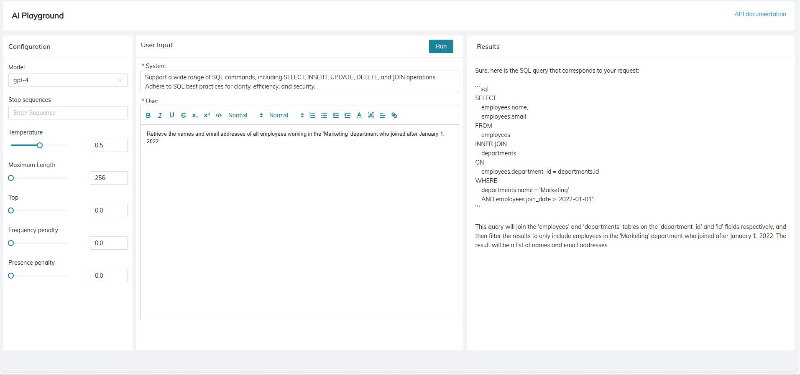

c. Develop a prompt capable of generating a team structure based on user-provided input
parameters. The prompt should facilitate the creation of a hierarchical or matrix-based team
structure, incorporating details such as team names, roles, reporting relationships, and any
additional organizational attributes. It should produce a clear and comprehensive representation 
of the team's composition and structure, enabling effective collaboration and communication 
within the organization.

```
system prompt:

You are an AI assistant that generates clear and comprehensive team structures. Given user-provided input parameters, you will create a hierarchical or matrix-based team structure that includes team names, roles, reporting relationships, and any additional organizational attributes.

Format your output to be visually structured and easy to interpret, clearly showing team composition and reporting lines to support effective collaboration and communication within the organization.
```

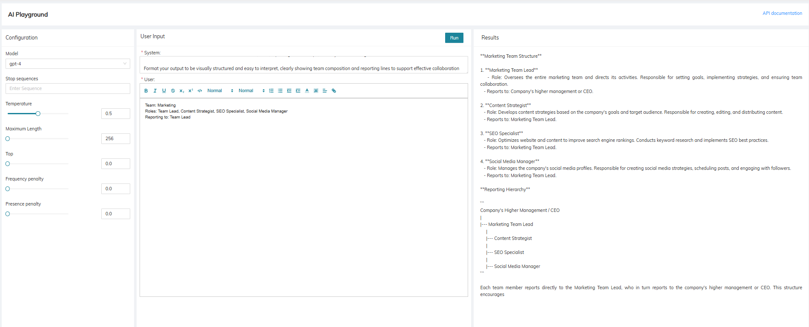


d. Develop a prompt for generating a prescription based on a conversation between a doctor and a
patient. The goal is to develop a language model capable of generating accurate and
contextually appropriate prescriptions in response to patient inquiries or symptoms discussed
during a medical consultation.

```
system prompt:

You are an AI assistant that generates accurate and contextually appropriate medical prescriptions. Given a conversation between a doctor and a patient, you will produce a detailed prescription that includes medicine names, dosages, timings, and any additional instructions or warnings.

Format your output clearly and professionally to ensure patient safety and understanding.
```

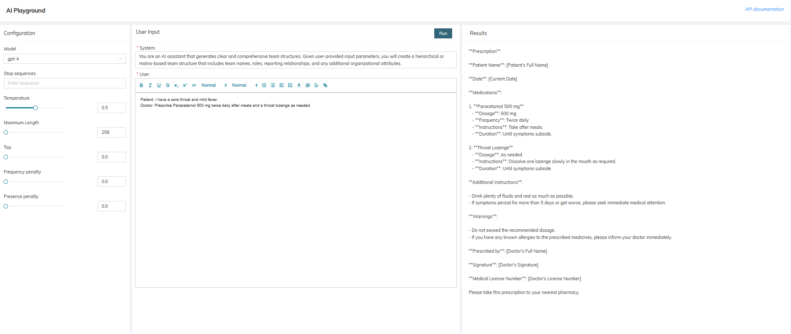


e. Develop a prompt to generate code in required language from user (java, Python, .Net etc) in
the use case. Code should be properly formatted and include comments.

```
system prompt:

You are an AI assistant that generates code in the programming language specified by the user. Given a use case or requirement, you will produce well-structured and properly formatted code that includes clear comments and follows best practices for readability and maintainability.

Ensure your output is easy to understand and ready for implementation.
```

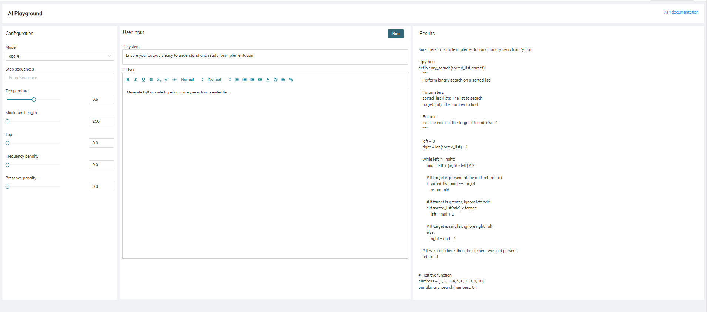


2. Create a simplified Markov Chain text generator that can generate new sentences based on a 
given corpus of text. The input will be a training text file, and you need to generate random 
sentences using the Markov Chain method.

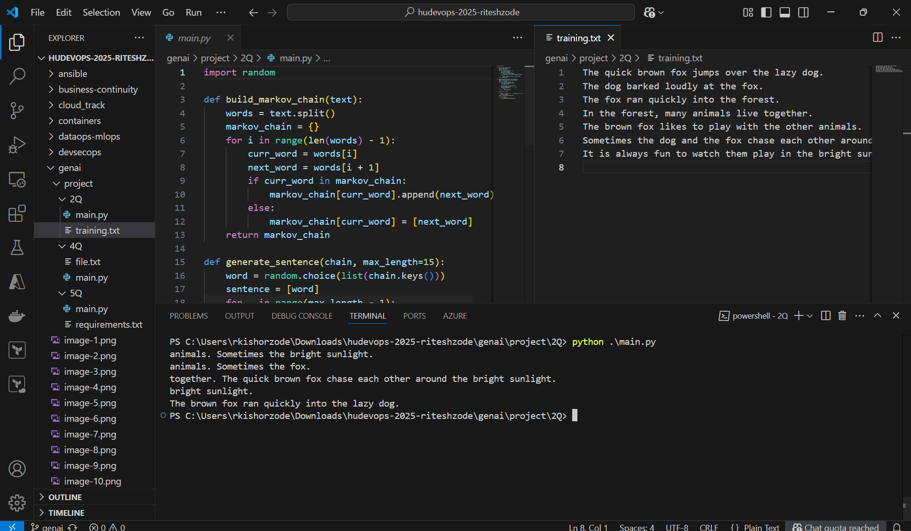

3. Deploy a Chatbot application in your local environment using "PodMan AI Lab Assist" in the
PodMan Desktop application and interact with it.
Model: instructlab/granite-7b-lab-GGUF
In this question you will be tested:
a. How the application and AI Model interact with each other
b. How the setup is done under the hood.
Note: Attach screenshots validating all the scripts/code generated

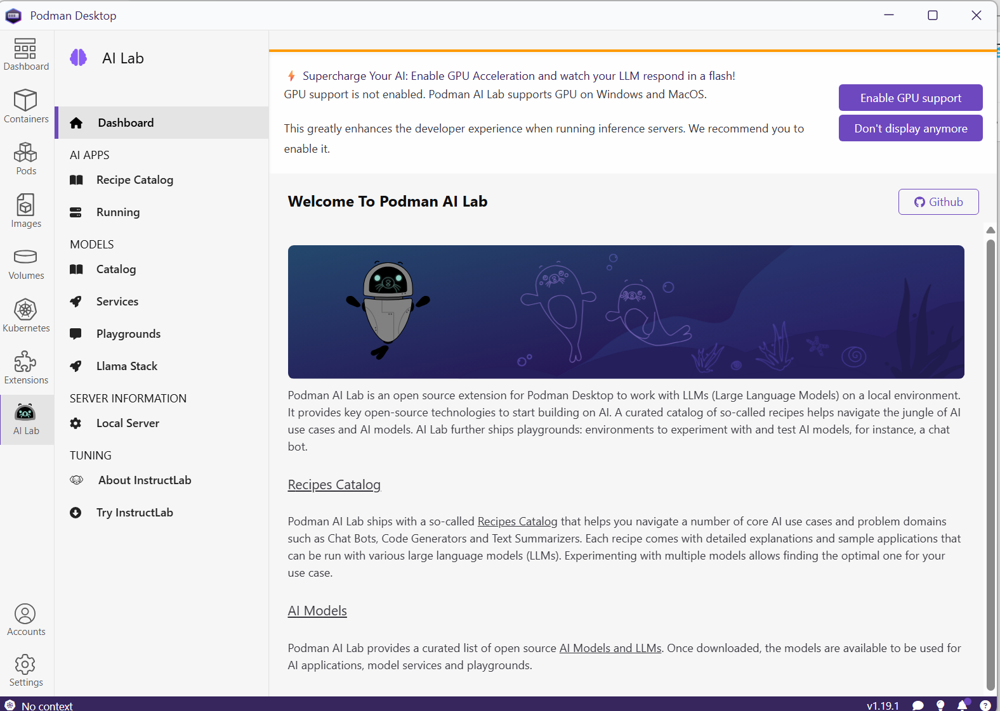

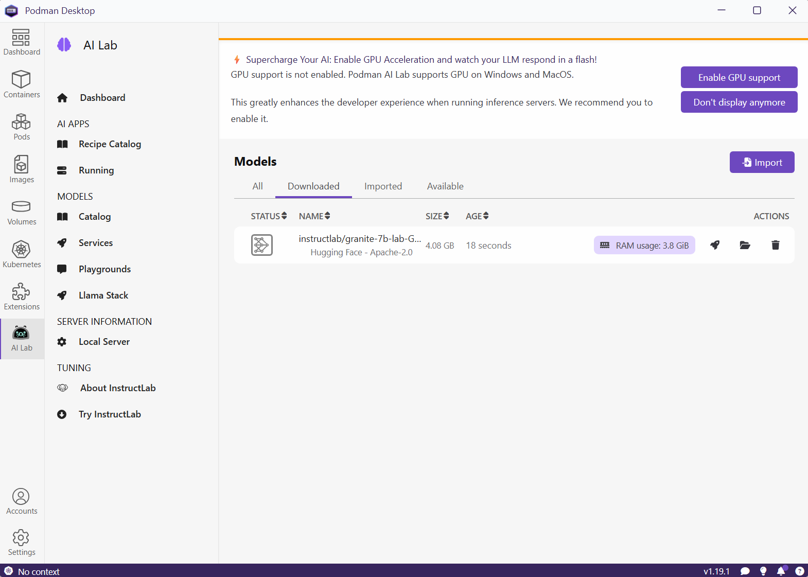

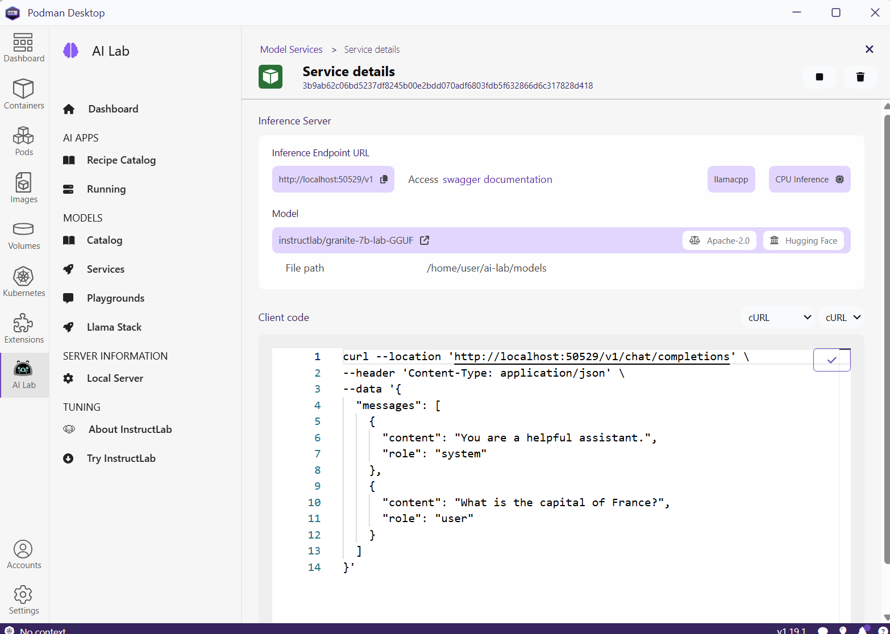

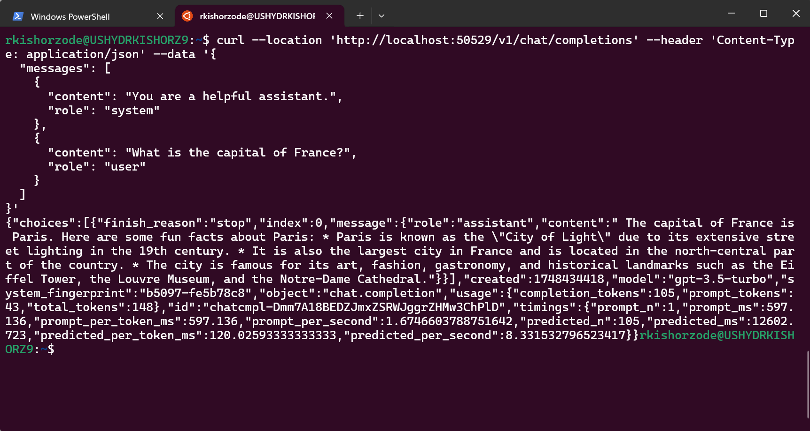

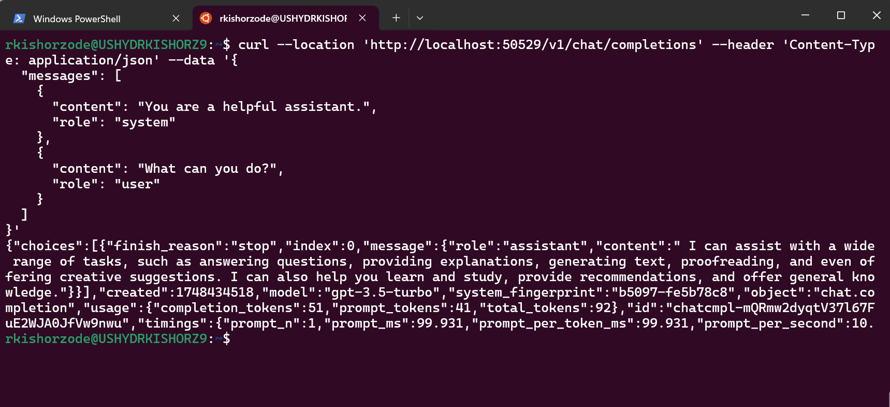

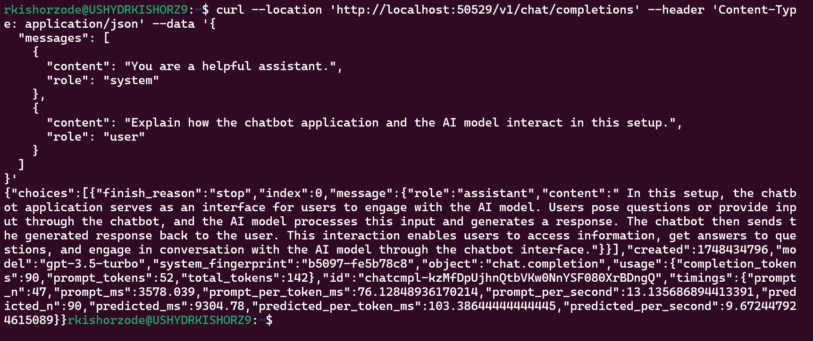

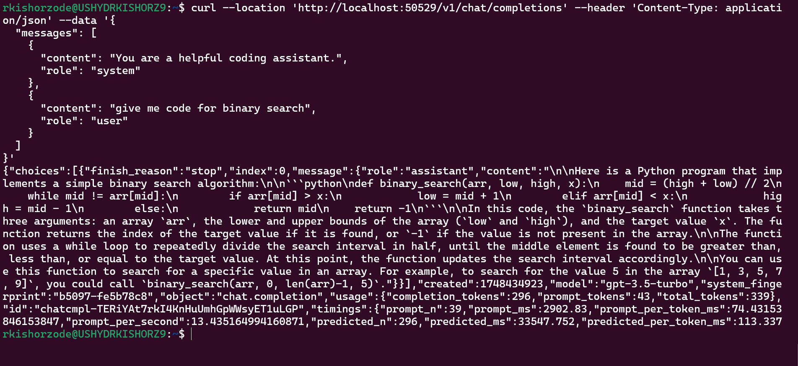

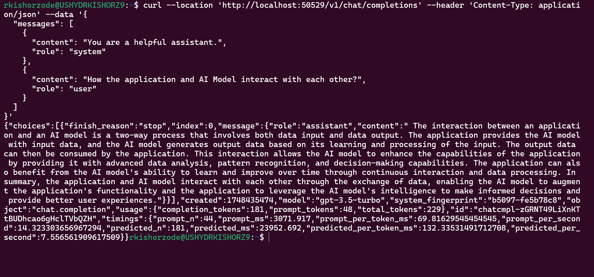


4. Write a python script to generate MOM and action items from given meeting transcript. 
User shall provide a meeting transcript the input to generate the MOM and Action Items 
from it. The transcript can be downloaded from their teams or any other sample. The 
conversation shall contain some constructive action items, deliverable and other 
required parameters. Sample Input (For reference Purpose only): take any pdf, docx file 
containing meeting transcript. Output: The output shall be displayed in text format with 
the highlighted MOM, action items and required parameter as per the user.


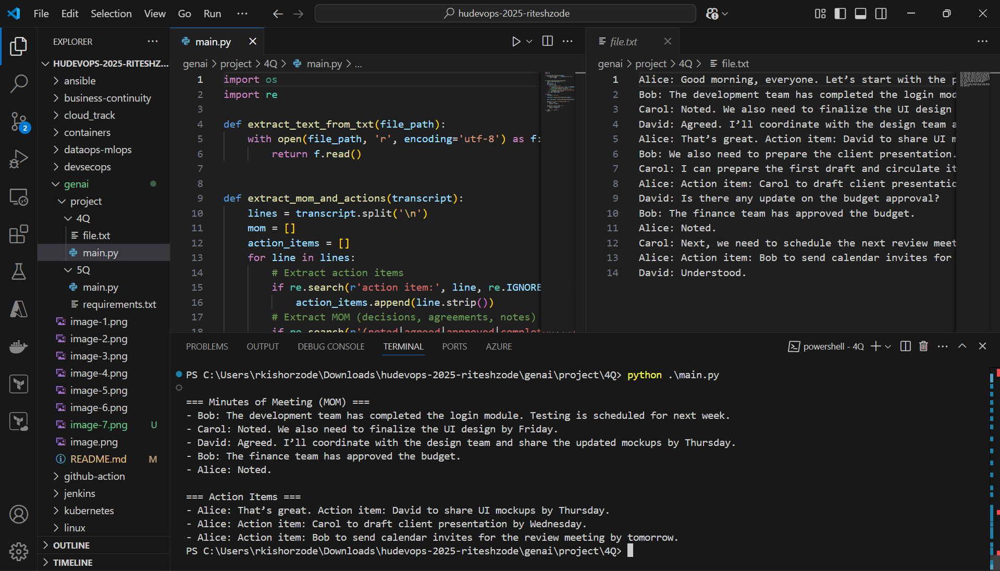

5. Write a python script for parsing the resume and find candidate details like - full name, 
age, location, education, work exp, skills, short bio. Input: Feed in the resume as the 
input in text form. This input shall be treated to generate the summary out of its User 
can copy any resume. Make sure the resume is properly formatted and is more real

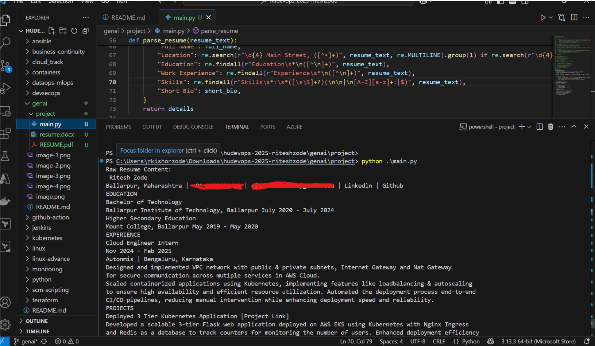

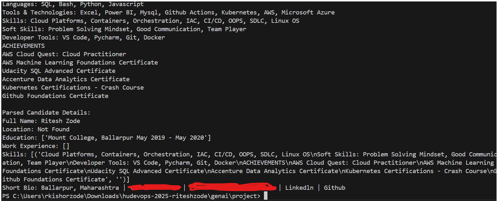
