## Jenkins

Q1 . Sample pipeline to build Docker image and Docker push.
- Create a GitHub repository.
- Build the sample application - Backend-Service.
- Push to private Docker registry.

```
pipeline {
    agent any

    stages {
        stage('Clone Repo') {
            steps {
                git url: 'https://github.com/riteshzode/Meme-Flask-Docker-Website.git', branch: 'main'
            }
        }

        stage('Build') {
            steps {
                sh 'docker build -t riteshzode18/sample-flask-app:$BUILD_NUMBER .'
            }
        }

        stage('Testing') {
            steps {
                echo 'testing'
            }
        }

        stage('Push') {
            steps {
                script {
                    // Login to Docker Hub
                    withCredentials([usernamePassword(credentialsId: 'DOCKERHUB', passwordVariable: 'DOCKERHUB_PASSWORD', usernameVariable: 'DOCKERHUB_USERNAME')]) {
                        sh 'docker login -u $DOCKERHUB_USERNAME -p $DOCKERHUB_PASSWORD'
                    }
                    
                    sh 'docker push riteshzode18/sample-flask-app:$BUILD_NUMBER'
                }
            }
        }

        stage('Deploy') {
            steps {
                sh 'docker rm -f my-app'
                sh 'docker run --name my-app -d -p 5000:5000 riteshzode18/sample-flask-app:$BUILD_NUMBER'
            }
        }
    }
    
    post {
        always {
            cleanWs()
        }
    }
}

```

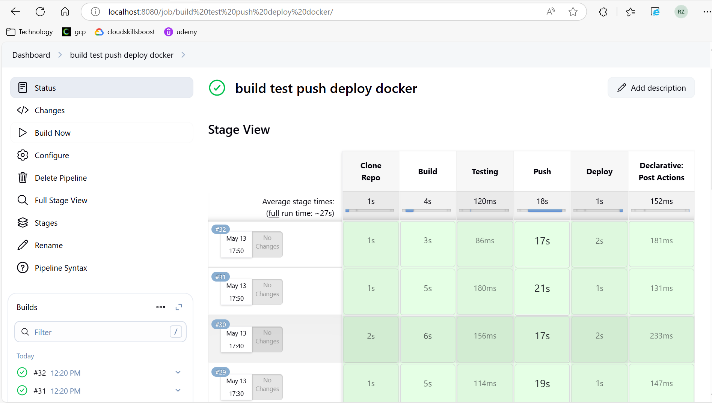

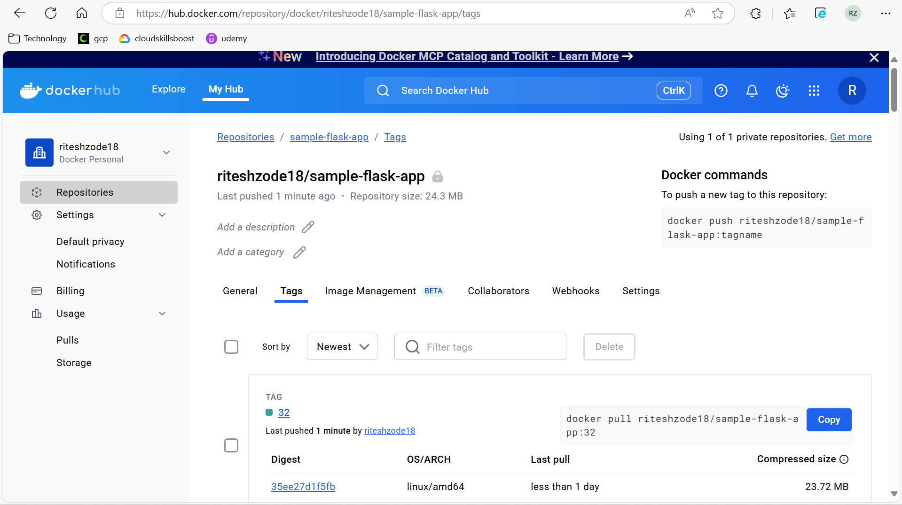


Q 2. Scheduled pipeline in Jenkins
- Change the previous pipeline to schedule-based pipeline.
- Pipeline should trigger every 5 minutes.

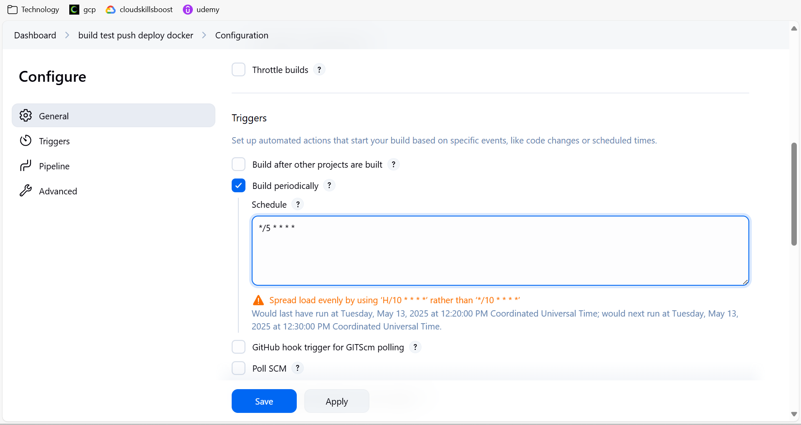

note: cron job shedule for every 5 min 
```5/* * * * *```

link: https://crontab.guru/


Q 3. Multistage Jenkins pipeline and handling secrets as parameters
- Create a multistage pipeline that includes stages for building, testing, and deploying an 
application.
- Configure the pipeline to handle secrets securely using Jenkins credentials.

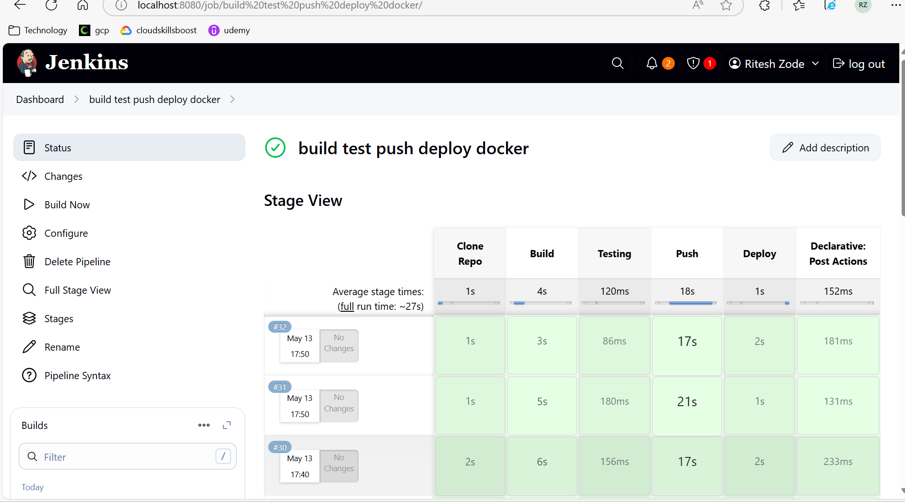

note: same pipeline will also deploy the container

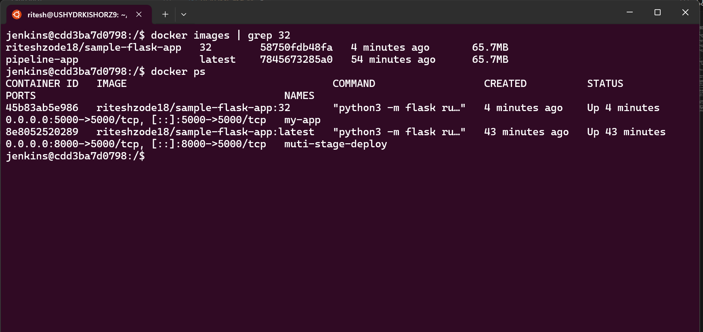


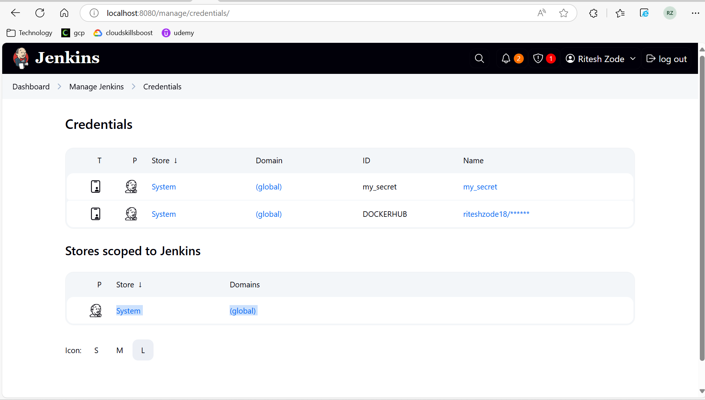

note: i create Personal access tokens in dockerhub -- token expire in 24 hours and updated it in secrets in jenkins


Q 4. Create a Multiple Jenkins pipeline for Build and Deploy stage.
- Create a one pipeline for build the docker image and another pipeline for deploy 
the application.
- Once the build pipeline is successfully completed, trigger the deploy pipeline.

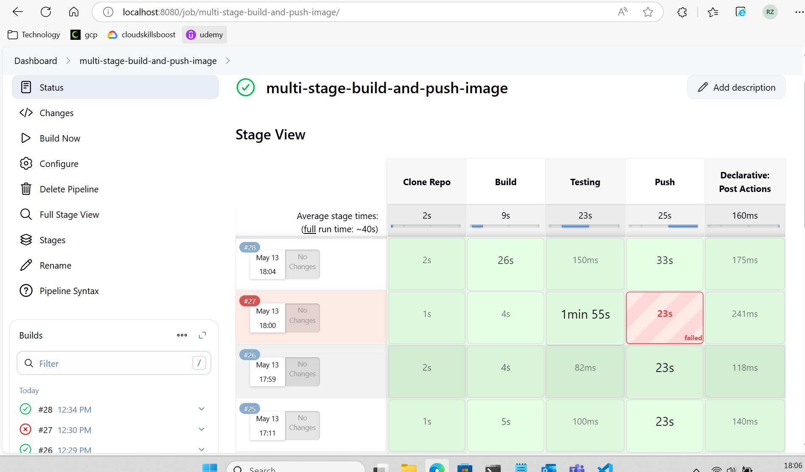

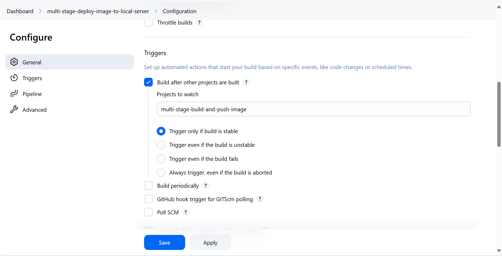

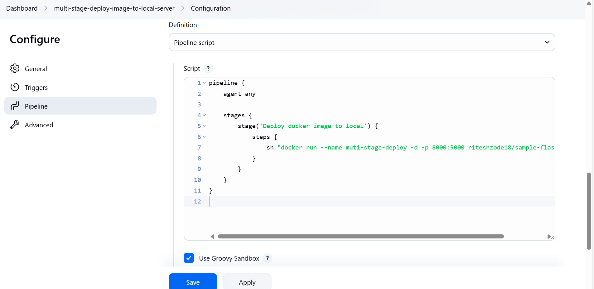

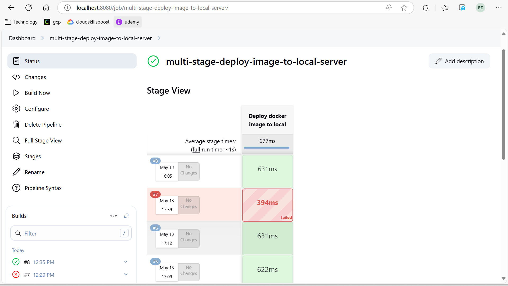

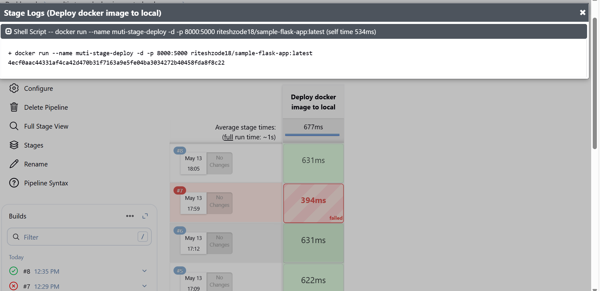

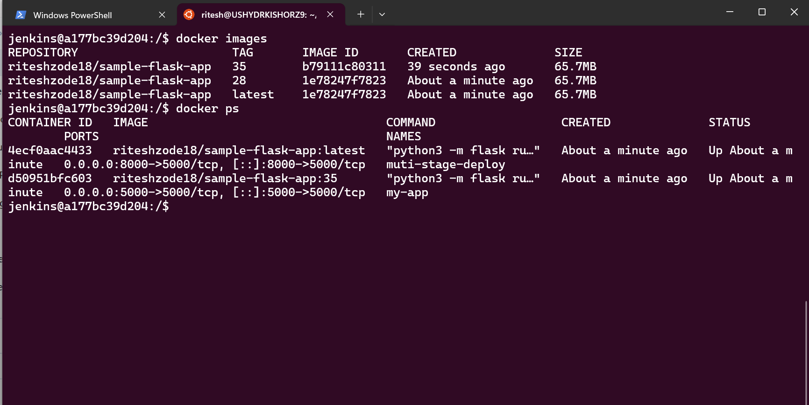


Q 5. Utilize Jenkins Configuration as Code (JCasC) to create a template for any of the 
above pipelines.
- Create a JCasC template to define the pipeline configuration.
- Ensure the template includes all necessary configurations and credentials.
- Implement a team's notification for any one of the above builds with necessary 
details.
- Configure Jenkins to send notifications to a Microsoft Teams channel.
- Include build details such as build ID, event, status, and actor in the notification


