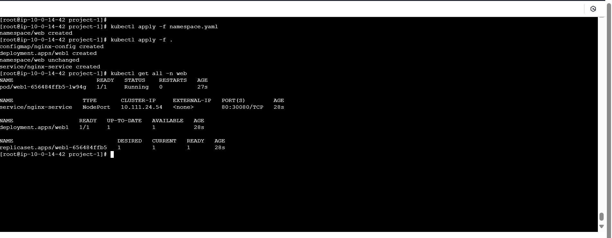
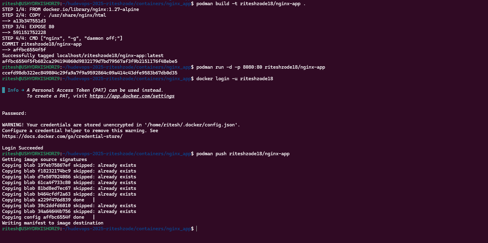
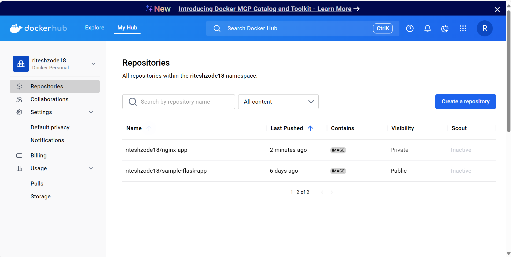

### Kubernetes Assignment

Kubernetes Assignment
Pre-requisite:
• Set up minikube in you local
Day 1: 
Scenario-1: Sample web application with configmap
1. Deploy a nginx deployment with name web1 and custom index.html(this needs to be 
done using configmap). Expose it to nodeport of 30080 in “web” namespace for this 
scenario.




Scenario-2: PV, PVC, secrets
2. Create a wordpress deployment with mysql as a database and expose it to nodeport 
30081. Use “volume” namespace for “wordpress” deployment and “database” namespace 
for mysql database and login to wordpress with predefined credentials.


Scenario-3: Multi container pod and logging
3. A. Create a pod named sidecar with 2 containers named main and sidecar respectively. 
Fetch the logs from app container to sidecar container. Use nginx for main and 
busybox:1.28 image for sidecar container. Use namespace sidecar for this scenario.
B. We need a Nginx web server pod that shows the Pod IP on the index page.
Here is how we can utilize init containers to deploy the pod displaying its IP address.
• One init container named write-ip gets the pod IP using the MY_POD_IP env 
variable populated from the Pod's own status. and writes to an ip.txt file inside the 
/web-content volume attached to the pod.
• The second init container named create-html reads the pod IP from /web content/ip.txt file that contains the pod IP created by the first init container and 
writes it to /web-content/index.html file.
• Now, the main nginx container (web-container) mounts the default 
/usr/share/nginx/html to /web-content volume where we have the index.html file.
Scenario-4: Network Policies 
4. Create deployments named web2 and app2 in web and app namespaces respectively. 
Allow ingress traffic to app2 from web2 and deny traffic from other namespaces and 
pods. Use nginx image for both the deployments.
Hint: Use network policies for this scenario and test it from other pods and 
namespaces.(Calico)
Scenario-5: Private Docker registry, Resource Limits and Health checks
5. Push a Docker image to your private docker registry and create a deployment to pull the 
image from the private registry. Create a pod with below info and restart whenever its 
health check is failed. 
Name: nginx-resource, Image: nginx, Memory requests: 128Mi and limits: 512Mi, Cpu: 
requests: 200m and limits 400m
Hint: Use podman for image push to private docker registry.





```
kubectl create secret docker-registry regcred \
  --docker-username=DOCKERHUB_NAME \
  --docker-password=DOCKERHUB_PASSWORD \
  --docker-email=YOUR_EMAIL
```


### Submission Rules-
● Submit the assignment by providing the screenshot of the output covered with the full 
screen of your machine in a document.
● Push manifests files used to create the workloads in the k8s-assignments branch. 
Differentiate the manifests files like 1-pod.yaml, 2-deployment.yaml, etc
● Also, push a Document on how you troubleshoot the errors while provisioning your 
cluster.
● Any sensitive secrets, file should not be placed in plain text or pushed to github