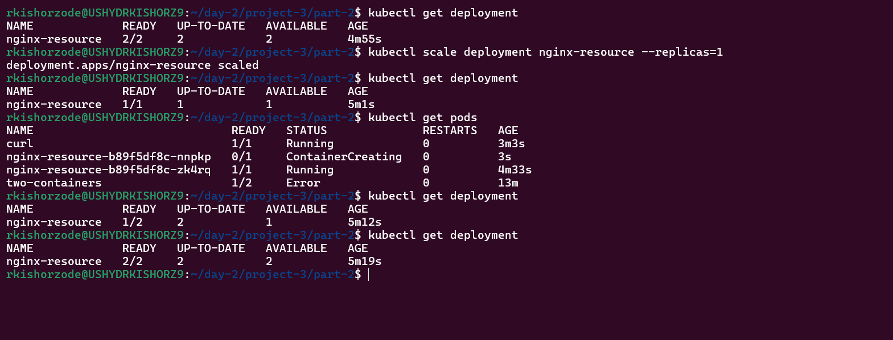

### Kubernetes Assignment Day 1

Kubernetes Assignment
Pre-requisite:
• Set up minikube in you local
Day 1: 
Scenario-1: Sample web application with configmap
1. Deploy a nginx deployment with name web1 and custom index.html(this needs to be 
done using configmap). Expose it to nodeport of 30080 in “web” namespace for this 
scenario.


Scenario-2: PV, PVC, secrets
2. Create a wordpress deployment with mysql as a database and expose it to nodeport 
30081. Use “volume” namespace for “wordpress” deployment and “database” namespace 
for mysql database and login to wordpress with predefined credentials.


Scenario-3: Multi container pod and logging
3. A. Create a pod named sidecar with 2 containers named main and sidecar respectively. 
Fetch the logs from app container to sidecar container. Use nginx for main and 
busybox:1.28 image for sidecar container. Use namespace sidecar for this scenario.
B. We need a Nginx web server pod that shows the Pod IP on the index page.
Here is how we can utilize init containers to deploy the pod displaying its IP address.
• One init container named write-ip gets the pod IP using the MY_POD_IP env 
variable populated from the Pod's own status. and writes to an ip.txt file inside the 
/web-content volume attached to the pod.
• The second init container named create-html reads the pod IP from /web content/ip.txt file that contains the pod IP created by the first init container and 
writes it to /web-content/index.html file.
• Now, the main nginx container (web-container) mounts the default 
/usr/share/nginx/html to /web-content volume where we have the index.html file.


Scenario-4: Network Policies 
4. Create deployments named web2 and app2 in web and app namespaces respectively. 
Allow ingress traffic to app2 from web2 and deny traffic from other namespaces and 
pods. Use nginx image for both the deployments.
Hint: Use network policies for this scenario and test it from other pods and 
namespaces.(Calico)


Scenario-5: Private Docker registry, Resource Limits and Health checks
5. Push a Docker image to your private docker registry and create a deployment to pull the 
image from the private registry. Create a pod with below info and restart whenever its 
health check is failed. 
Name: nginx-resource, Image: nginx, Memory requests: 128Mi and limits: 512Mi, Cpu: 
requests: 200m and limits 400m
Hint: Use podman for image push to private docker registry.


```
kubectl create secret docker-registry regcred \
  --docker-username=DOCKERHUB_NAME \
  --docker-password=DOCKERHUB_PASSWORD \
  --docker-email=EMAIL_ID
```


### Submission Rules-
● Submit the assignment by providing the screenshot of the output covered with the full 
screen of your machine in a document.
● Push manifests files used to create the workloads in the k8s-assignments branch. 
Differentiate the manifests files like 1-pod.yaml, 2-deployment.yaml, etc
● Also, push a Document on how you troubleshoot the errors while provisioning your 
cluster.
● Any sensitive secrets, file should not be placed in plain text or pushed to github


### Kubernetes Assignment Day 2

Kubernetes Assignment Day Two
Question 1: Kubernetes Dashboard. 
1.1. Enable kubernetes dashboard and create separate token to access 
it.(Provide screenshot of it.)
1.2. Deploy metrics-server and provide the screenshot of node and pod resource 
usage
If you are getting any issues 
Error from server (ServiceUnavailable)
Edit the running deployment and Add this entry(hostNetwork: true) below dns 
policy or at the end of the container section above the restart Policy. 


Question 2: Helm
2.1. Run the helm charts helm-sample-app-0.0.1.tgz which is present inside the 
Assignment_Resources folder.
Use the newly created namespace for running helm charts. 
Namespace should be in the format: {Yourfistname-project}
If you face any issues while running the helm charts , then debug those errors 
and 
make sure that the helm chart is deployed properly. While you debug those 
errors also make sure that you also make following changes in the chart.
Add following changes in the Chart.yaml
● Modify Chart name: {Yourfirstname}-dev
● Add maintainers field in Chart.yaml under this you can have a variable like 
name, email(Your hashedin email id). Here name refers to your name 
(chart owner name).
● Each time when you run helm upgrade command make sure that you're 
changing the chart version from 0.1.0 to the latest version in the 
Chart,yaml file. Ex: {0.1.0,0.2.0,0.3.0 ….}
Submit the output along with the next question.


2.2. Update the same helm chart and upgrade the same deployment by changing 
the image tag to ‘1.18.0’ and replica count to 2 from 1. 
Now using helm command, rollback the deployment to the previous successful 
deployment version.
P.S: your output screenshot should have the following: 
output of 
● You can use the helm package command to package the final working 
helm charts. Packaged helm chart should be in the {Yourfirstname}-dev-
{chart-version}.tgz format (no screenshot)
● "$ kubectl get all -n namespace -o wide" 
● helm history yourrelease_name -n namespace


Question 3: 
3.1 Run the given deployment manifest file log-deployment.yaml under the gdrive 
Assignment_Resources folder which has 2 containers (container1 and container2 ) 
placed inside the single pod. 
Take the logs of both the containers one by one and write the log data over files 
called c1.log and c2.log.
P.S: c1.log file should have container1 logs only and c2.log should have logs of 
container2 only.
HPA:


3.2 Create HPA for the deployment “nginx-resource” (Day 1 question 5) with memory 
and cpu limit of 80%.
Min size=2
Max size=7
Pod should scale when cpu utilization or memory consumption is more than 80%
Also test out your application by using stress tools to see if autoscaling is 
happening.




<!--  -->


<!--  -->


Question 4: 
Deploying a Multi-Environment Application with Kustomize 
You are part of a DevOps team tasked with deploying a new web application across 
multiple environments (dev and prod). Your team has decided to use Kustomize to 
manage Kubernetes configurations efficiently. 
4.1. Initial Setup and Customization: 
Scenario: The application needs to be deployed with different configurations in 
development and production environments. The development environment requires 
a single replica for testing, while production needs three replicas for high 
availability. 
Task: Create a base Kubernetes configuration for the application. Use Kustomize 
to set up overlays for both environments, adjusting the replica count and resource 
limits accordingly. 
4.2 Configuration Management: 
Scenario: The application requires different environment variables and ConfigMaps 
for each environment. Additionally, sensitive information such as database 
credentials must be securely managed. 
Task: Use Kustomize to generate and customize ConfigMaps and Secrets for each 
environment. Ensure that environment-specific variables are correctly applied 
without exposing sensitive data. 
Note: As part of the deployment process, all resources must include a consistent 
naming convention and labeling strategy to facilitate monitoring and management.


Question 5: 
You are tasked with creating a Custom Resource Definition (CRD) in Kubernetes for 
a new resource type called Linker under the API group training.com.
The CRD should define:
The resource with plural linkers and singular linker.
The resource kind as Linker with a short name lk.
A version v1 that is both served and stored.
A spec containing two string fields: name and technology. After creating the CRD, 
define a sample Custom Resource (CR) instance named my-linker-sample with:
Example: name as "Siddhartha's Linker", technology as "Kubernetes"
Tasks:
1. Write the YAML manifest for the CRD.
2. Write the YAML manifest for the CR.
3. List the kubectl commands you would run to apply these manifests and verify the 
creation of the CR.
