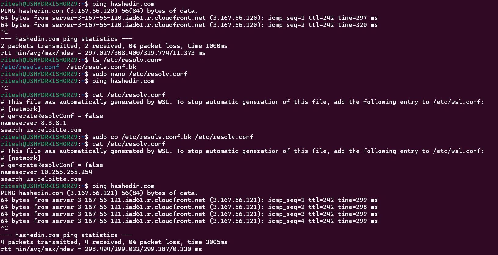

HashedIn University Linux Advance Assignment 

1. DNS


A. When you perform an nslookup for a domain name, the DNS resolution process involves 
multiple stages, starting from the root DNS servers down to the authoritative name servers. 
Using appropriate tools or commands, how can you trace the full DNS resolution path and 
identify all the intermediate DNS servers (like root, TLD, and authoritative servers) involved in 
resolving a domain name (Hashedin.com, Deloitte.com, dna.hashedin.com)? Please explain the 
steps and provide the command(s) used along with the output interpretation.

answer:

```
dig +trace hashedin.com
```
Explain:

use dig +trace domain.com to trace DNS resolution step by step to root, TLD and authoritative servers


 
B. On a Linux system perform the below tasks:


i) Add a custom entry in a file in linux file system where it should point to loopback address when 
you enter “mypc.test”. 


commands:
```
sudo nano /etc/hosts
sudo cat /etc/hosts
```


explain:
point mypc.tst to localhost (127.0.0.1)
127.0.0.1   mypc.test


ii) Verify that the domain “mypc.test” resolves to your loopback address using necessary linux

commands:

```
ping mypc.test
```


iii) Temporarily comment out the entry in the file and the test the resolution again. What do you 
observe?

commands:

```
nano /etc/hosts -- comments the entry
ping mypc.test

```


C. Update your nameserver resolver to a dummy IP(such as 8.8.8.1) and try accessing the 
hashedin.com domain.
commands:
```
ping hashedin.com
sudo cp /etc/resolv.conf /etc/resolv.conf.bk  -- to save backup
sudo nano /etc/resolv.conf -- replace nameserver with dummy ip (8.8.8.1)
ping hashedin.com -- this will give errror
sudo cp /etc/resolv.conf.bk /etc/resolv.conf  -- copy original nameservers from backup
ping hashedin.com -- it will work
```





2. Network Analysis

How can I capture and analyze HTTP traffic generated on a locally hosted server(running on port 
8080) under synthetic load to understand request patterns, response behavior, and overall 
network activity?

i) What methods can be used to capture only HTTP traffic on a specific port for detailed 
inspection of requests and responses?

```
sudo tcpdump -i any tcp port 8080 -w capture.pcap
```

ii) How can one isolate and interpret different HTTP methods and status codes from a larger 
volume of captured traffic? 
```
sudo tcpdump -A -s 0 'tcp port 8080 and (((ip[2:2] - ((ip[0]&0xf)<<2)) - ((tcp[12]&0xf0)>>2)) != 0)'
```

iiI) What techniques allow extraction of specific HTTP header fields, such as Host, User_agent, or 
the request URL. 
```
sudo tcpdump -A -s 0 'tcp port 8080'
```
iv) How can the captured network traffic be summarized to highlight patterns in HTTP requestresponse interactions, especially under heavy load? 
```
tshark -r capture.pcap -q -z http,stat
```

v) List the TCP handshake and session initiation for the HTTP traffic on port 8080? 
```
sudo tcpdump -i any tcp port 8080 and '(tcp[tcpflags] & (tcp-syn|tcp-ack) != 0)'
```
 
3. Simulate two isolated network namespaces be created on a single host, such that each 
environment runs a separate process and both are connected via a common virtual bridge, 
allowing them to communicate with each other (e.g., ping each other)? 

```
Explain:
1. create 2 network namespace
2. create a virtual bridge
3. connect both namespace to bridge
4. assign ips and bring up interface
5. check communication 
6. delete all network and bridge
```


4. Spin up two Ubuntu VMs in Vmware – VM1 and VM2.


4.1 Configure a custom route in VM1 to forward traffic to 9.9.9.9 to be forwarded to 
VM2 and verify using tcpdump. Make sure that ping to 9.9.9.9 receives reply by 
configuring VM2 to forward the packets.

```
vm2

sudo sysctl -w net.ipv4.ip_forward=1

vm1

sudo ip route add 9.9.9.9/32 via 192.168.252.129

vm2

sudo ip addr add 9.9.9.9/32 dev ens33

vm2

sudo tcpdump -i ens33 host 9.9.9.9

vm1

ping 9.9.9.9

```


4.2 Get the ARP cache of both the VMs. Delete the current IP address. Pick a /24 network 
from the private IP range 172.16.0.0/16 and assign a static IP address manually to both 
the VMs. Ensure that the VMs can ping each other. Now delete the IP addresses and use 
DHCP to automatically assign IP addresses to the interfaces.

```
1. Get the ARP Cache
arp -n

2. delete ip of both vm
sudo ip addr flush dev ens33

3. assign static ip

vm1
sudo ip addr add 172.16.1.10/24 dev ens33
sudo ip link set ens33 up

vm2
sudo ip addr add 172.16.1.20/24 dev ens33
sudo ip link set ens33 up

4. check
vm1
ping 172.16.1.20

vm2
ping 172.16.1.10

5. delete the static ip
sudo ip addr flush dev ens33

6. assign new ip dynamically
sudo dhclient ens33

7. check
ip a

```


Configure a custom route in VM1 to forward traffic to 9.9.9.9 to be forwarded to VM2 and verify 
using tcpdump. Make sure that ping to 9.9.9.9 receives reply by configuring VM2 to forward the 
packets.


5. Build and validate a PKI setup using your Own CA. The PKI should be used to secure an NGINX 
server and perform certification verification.

```installation```


```
1. setup own cerificate Authority
```


```
2. Create certificate for nginx
```


```
3. Sign the Server Certificate with Your CA
```


```
4.
1. Create a Directory for SSL Certificates:
sudo mkdir -p /etc/nginx/ssl
sudo cp server.crt server.key ca.crt /etc/nginx/ssl/
2. Edit the NGINX Configuration
sudo nano /etc/nginx/sites-available/default
```
```
server {
    listen 443 ssl;
    server_name localhost;

    ssl_certificate /etc/nginx/ssl/server.crt;
    ssl_certificate_key /etc/nginx/ssl/server.key;
    ssl_client_certificate /etc/nginx/ssl/ca.crt;
    ssl_verify_client on;

    location / {
        root /var/www/html;
        index index.html;
    }
}
```

```
5. Test and Reload NGINX
sudo nginx -t
sudo systemctl reload nginx
```

```
6. Validate the PKI Setup
curl -v --cacert ca.crt https://localhost
```


### project working
