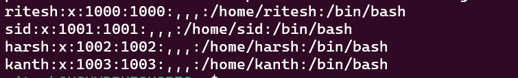
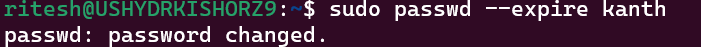
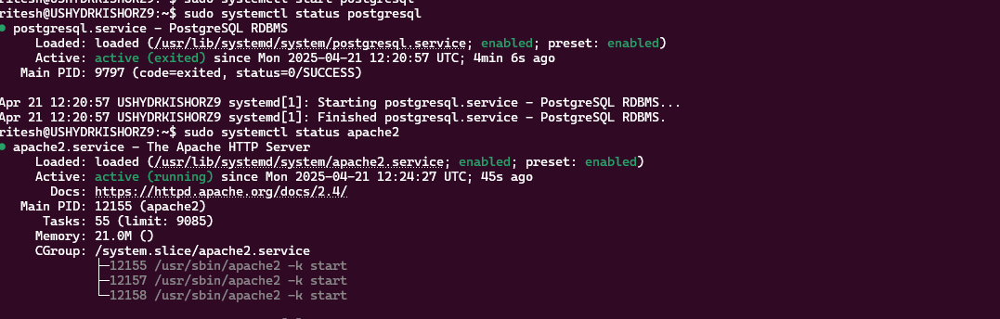

HashedIn University Linux Track Assignment 

1. Perform the below list of tasks to complete this Question. 

Create a directory called “Playground” in the “home” directory. Inside “Playground” directory, create two directories called “Cricket” and “Football” with single command. List the directories we created from “home” directory in “Tree format”. 

commands:
```
cd ~ && mkdir Playground && cd Playground && mkdir Cricket Football && cd .. && tree
```


Create the files “football_players.txt” and “cricket_players.txt” in “Football” and “Cricket” directories respectively and list the contents of each file with single command. 

Commands:
```
pwd 
cd ~
touch Playground/Football/football_players.txt
touch Playground/Cricket/cricket_players.txt
```


Now create a directory called “Players” inside the “home” directory and inside the “Players” directory Create two files, “football_players.txt” and “cricket_players.txt” and open the respective files in your favorite text editors and add your 11 players of your choice in each file. List/print the first five players from cricket and last five players from football with single command. 

commands:
```
mkdir Player -- will create a player foulder
cd Player
touch football_players.txt cricket_players.txt
nano football_players.txt
nano cricket_players.txt
tail -5 football_players.txt
head -5 cricket_players.txt
```


Now Copy the file “football_players.txt” which is present in the “Players” directory into the “Football” directory and print the content of this file present in the “Football” directory. Open the “cricket_players.txt” in the “Cricket” directory add Player “Virat Singh Kumar Dhoni Sharma” in the first line, cat the file to see the changes and then copy the “cricket_players.txt” present in the “players” directory into the “Cricket” directory, but while you are performing this activity it should show indicate “Overwrite?”. 

commands:
```
cp Players/football_players.txt Playground/Football/football_players.txt
cat Playground/Football/football_players.txt
nano Playground/Cricket/cricket_players.txt
cat Playground/Cricket/cricket_players.txt
cp Players/cricket_players.txt  Playground/Cricket/cricket_players.txt
```


 Rename the Directory “Players” present in the home directory to “Done” and delete the directory. 

commands:
```
mv Players Done
rm -rf Done
```


Create a Directory called “Coaches” in home directory and create two files inside “Coaches” directory called “football_Manger.txt”, “Cricket_coach.txt” and add content “Jose Alex Guardiola” and “Ravi Gambhir Dravid Ganguly” to the respective files your created. List the files present in the Coaches directory. Now create a hard link inside the Cricket directory with name “cric_coach” from the file “Cricket_coach.txt” in Coach dir and create a soft link with name “foot-manager” In Football dir from the file “football_manager” in Coach dir. List the files in the Cricket, Football directories with their inode numbers. Delete the folder “Coaches” and list the contents of the “cric_coach” and “foot-manager”. 

commands:
```
mkdir Coaches
cd Coaches/
touch football_Manger.txt
touch Cricket_coach.txt
echo "jose Alex Guardiola" > football_Manger.txt
echo "Ravi Gambhir Dravid Ganguly" > Cricket_coach.txt
cd ../Playground/Cricket/
ln ../../Coaches/Cricket_coach.txt cric_coach
cd Football/
ln -s ../../Coaches/football_Manger.txt foot-manager
rm -rf ../../Coaches/
ls -li
```


2. You are working as a DevOps engineer in a company, but your manager gave you a text file consist of Client Employee data and asked you to perform analytics on the data, use your DevOps and Linux Skills to solve the below tasks: 

Your manager stored the file in GitHub here, please use appropriate Linux command to download the file in your home directory.(The content of the file should not be in HTML format.) 

command:
```
wget -L https://raw.githubusercontent.com/mkuthan/example-spark/refs/heads/master/src/main/resources/data/employees.txt
```


Display the first 3 and last 1 lines of the file with one command. 

command:
```
head -3 employees.txt | tail -1
```

Find all employees whose last name is “Doe” and “Smith” and write the output to another file named “DoeandSmiths” 

command:
```
grep -E 'Doe|Smith' employees.txt > DoeandSmiths
```


Sort the employees based on their age in Descending Order, save the sorted data in the new file called sorted_employees.txt without displaying it on the screen and display the result and find out how many employees are listed in the file. 

command:
```
sort -t',' -k4,4nr employees.txt > sorted_employees.txt
```


Find the employee with the highest age using the most efficient command combination. 

command:
```
sort -t',' -k4,4nr employees.txt | head -1
```


Using the necessary command print the second column (First Name) and last Column(age) from the file. 

command:
```
awk -F',' '{print $2, $4}' employees.txt
```


Print the 3rd and 5th line and then delete the lines which contain the word “Doe”. 
command:
```
sed -n -e '3p' -e '5p' employees.txt
sed -i '/Doe/d' emp.txt
```


3. HashedIn has a confidential project called “Project HU”. Three employees “Sid”, “Harsh”, “Kanth” – Will work on it. Follow the requirement below: 

Create the above three users using the appropriate commands which also needs to create user home directories. 

commands:
```
sudo adduser sid
sudo adduser harsh
sudo adduser kanth
```


Create the groups “devops” and “SRE”. 

commands:
```
sudo groupadd devops
sudo groupadd sre
```


Add “Harsh” to the “devops” group, “Kanth” to “SRE” group. 

commands:
```
sudo usermod -aG devops harsh
sudo usermod -aG sre kanth
```


Add “Sid” to the “devops” group as administrator with “sudo” access. 

commands:
```
sudo usermod -aG devops sid
sudo usermod -aG sudo sid
```


Create a directory /Project-HU and ensure the “devops” group owns it. 
```
mkdir Project-HU
sudo chgrp -R devops Project-HU
```


Give the following permissions using numeric representation, members of the “devops” group should have read, write and execute permissions. Others should have no access. 

commands:
```
sudo chmod g+rwx Project-HU
or
sudo chmod 770 Project-HU
```


Create a script deploy.sh inside /Project-HU that prints “Project is Live” when executed. Set the execute permissions on deploy.sh using numeric methods. Confirm and display the permissions using the ls -l command. 
```
mkdir Project-HU
nano Project-HU/deploy.sh

write in file

#!/bin/bash
echo "Project is Live"

chmod +x Project-HU/deploy.sh
```


Check the password entry for “Harsh” and explain the meaning of each field in the line. 

commands:
```
sudo grep harsh /etc/passwd
or 
cat /etc/passwd | grep harsh 
```


Force “Kanth” to change his password at the next Login. 

commands:
```
sudo passwd --expire kanth
```


Set a password expiry warning for “Harsh” 7 days before the password expires. 

commands:
```
sudo chage -W 7 harsh
```


Now “Harsh” is released from the project, make sure he doesn’t have access to the /Project-HU.

commands:
```
sudo gpasswd -d harsh devops
```


Now delete the group “SRE” and user “Kanth” and list the files in the /home directory and check if the user directory is deleted or not . 

commands:
```
sudo groupdel sre
sudo userdel -rf kanth
ls -la /home
```


4. Complete the below set of instructions to complete this question: 

List all the current running processes in the system. 

command:
```
ps -aux
```


List all the background and foreground processes. 

command:
```
jobs -l
```


Start a simple background process and bring it to the foreground and again send it back to background. Finally kill the process and confirm it has stopped. 

commands:
```
sleep 50 &
fg %1
ctrl + z -- to stop that process
bg %1
kill %1
```


Start a “sleep” process and find it ID, lower its priority, and verify the priority. 
```
sleep 1000&
ps -aux | grep sleep
renice +10 <process-id>
```

Check how many available disks attached to the server and distinguish between OS disk and other disks attached to the server. 
```
ps -0 pid,ni,comm -p <process-id>
```

Check the available disk space. Find the 3 largest files or directories in your /home directory. 

commands:
```
lsblk
du -ah /home | sort -rh | head -n 3
```


Create a dummy file of size 10MB and confirm the file size. 

commands:
```
dd if=/dev/zero of=dummy_file.txt bs=1M count=10

ls -lh dummy_file.txt
```

Set environment variables of your size and display them. 

command:
```
export name=ritesh
echo $name
or
printenv
```


5. You are a Linux administrator working in company and below are the tasks are pending in your plate, so please complete them before your manager have a talk with you: 

Your team wants a customized login message to display information every time someone logs into the server using SSH or a terminal, you need to apply these changes without logging out and confirms the message when you open a new terminal: 

“Welcome, User! Today is date. 

 Free Memory: space available” 


Install Apache, Nginx and PostgreSQL using the installed package manager in your system, ensure all three services are enabled and running. Create a user “db_admin” and ensure that this user create a table called “db_admin”. Use system resource monitoring commands to verify the services. 

Enable logging for both Nginx and Apache, then analyze the logs. 
```
sudo apt update
sudo apt install -y apache2 nginx postgresql
sudo systemctl start apache2 
sudo systemctl start nginx 
sudo systemctl start postgresql


sudo -u postgres psql

CREATE USER db_admin WITH CREATEDB PASSWORD 'password';
CREATE DATABASE db_admin;

\c db_admin
CREATE TABLE test_table (id PRIMARY KEY, name VARCHAR(50));
\q
```


 
