## Observability Assignment
Important Notice:
• For Docker Images always refer the official verified image of the tools from docker hub/tool 
and use.
• Don’t run the container as Root user.
• Don’t pull and push images from/to untrusted domains.
• Document all your steps with screenshots and delete the resources once done.
• All Resources created should be tagged.
• In AWS, use region as us-east-1 and VPC: HU-devops-2025
• Follow all the Security Best practices.
Local:
1. Using docker, set up Prometheus and Node exporter on your local machine with persistent 
docker storage.
a. Monitor the system performance metrics of your local container using Prometheus.
b. Add node exporter job to Prometheus configuration to scrape the metrics of 
container.
c. Find the average amount of CPU time spent in system mode, per second, over the 
last minute (in seconds)
d. Find the average network traffic received, per second, over the last minute (in bytes)
e. Find filesystem space available to non-root users.

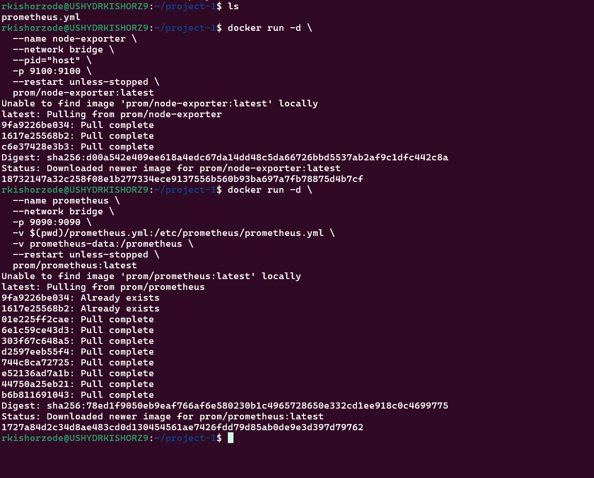

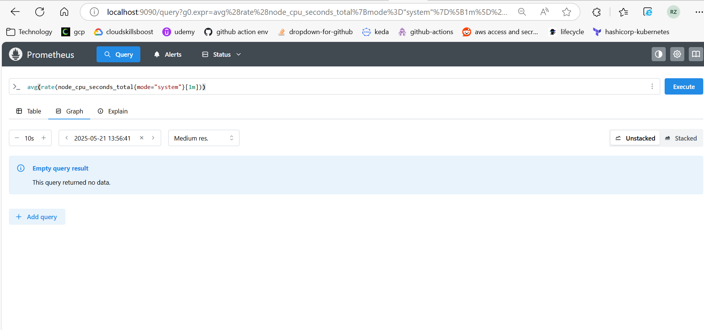

2. Setup elk stack using official docker images on your local
a. Get a sample log file of nginx and upload it to the ELK.
b. fetch all the status code on the nginx logs, do indexing and visualization according to 
it.
c. Create a dashboard for the visualizations.
AWS

<!-- 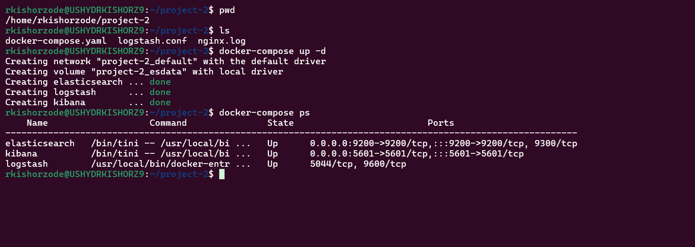 -->
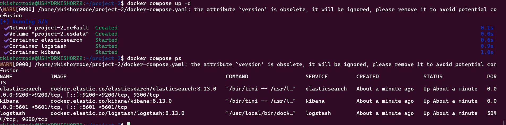

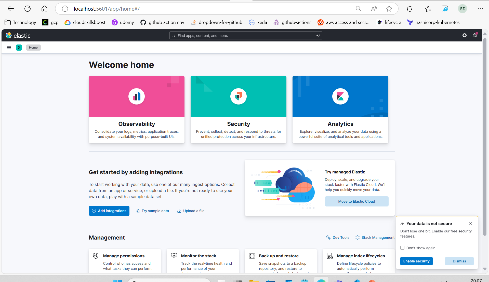

3. Create an EC2 instance with AmazonAMI-2 image and t2.nano instance size.
a. Install stress tool for increase cpu and memory to 80%,
b. Set up CloudWatch metrics to monitor the CPU and Memory usage of the EC2 
instance. Configure an alert to trigger when either the CPU or Memory utilization 
exceeds 75%.
c. Connect to the instance using Session Manager.
d. Create a dummy log file under /var/log/<application logs> on the EC2 instance.
e. Install the CloudWatch agent on the instance to push logs to CloudWatch.
f. Stream application logs (use logs from here) from the EC2 instance to CloudWatch 
for monitoring.
g. Setup Grafana in the vm and add service account as data source. Create a new 
Grafana dashboard for showing the following metrics:
i. CPU Utilization
ii. Uptime
iii. Disk read and write operations

SRE – Assignment
Assignment 1: Observability with Prometheus, Loki & Grafana
Title: Monitor & Analyze a Sample App Using SRE Tooling
Objective:
Understand how to collect and visualize application metrics and logs using core observability 
tools.
Tasks (Max 40 mins)
1. Deploy a lightweight web app using Docker or Kubernetes. 
(e.g., Nginx or Node.js, app: https://github.com/dockersamples/example-voting-app.git)
2. Configure Prometheus to collect metrics (e.g., CPU, memory) using Node Exporter.
3. Set up Promtail to forward logs to Loki.
4. Integrate both Prometheus and Loki into Grafana, and create a dashboard showing:
• App uptime or CPU usage (metrics)
• Live log stream and many more.

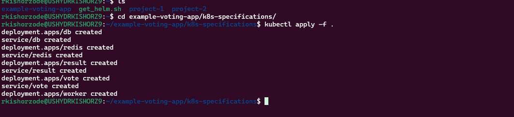

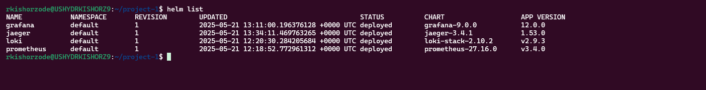

<!-- 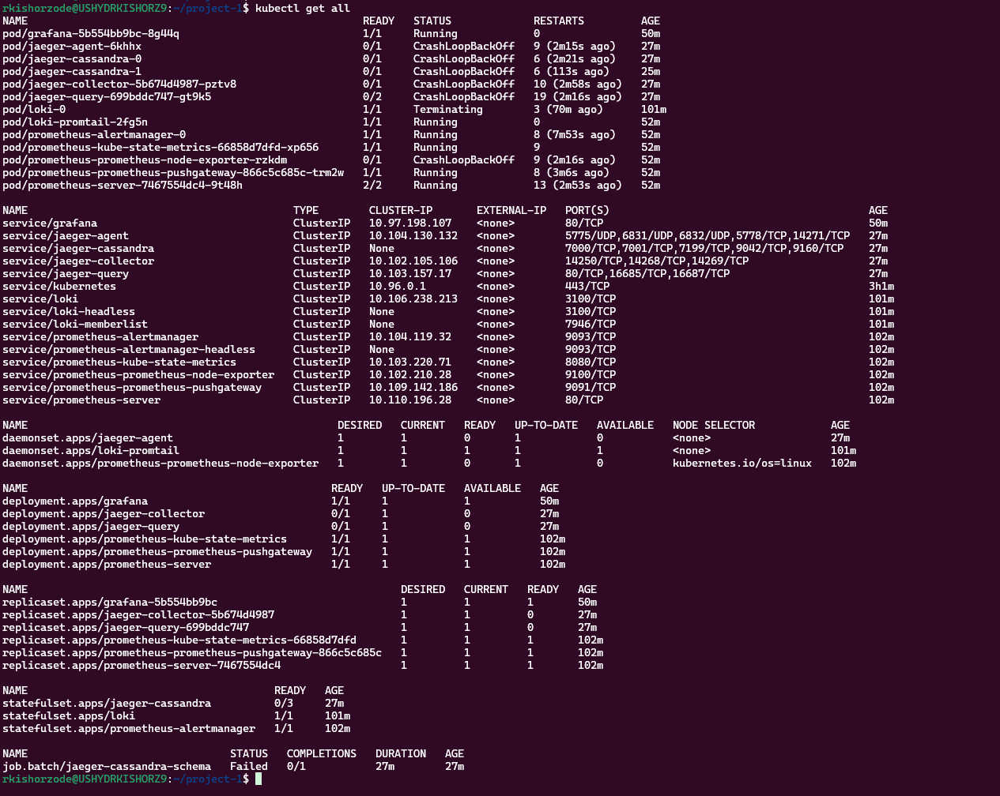 -->

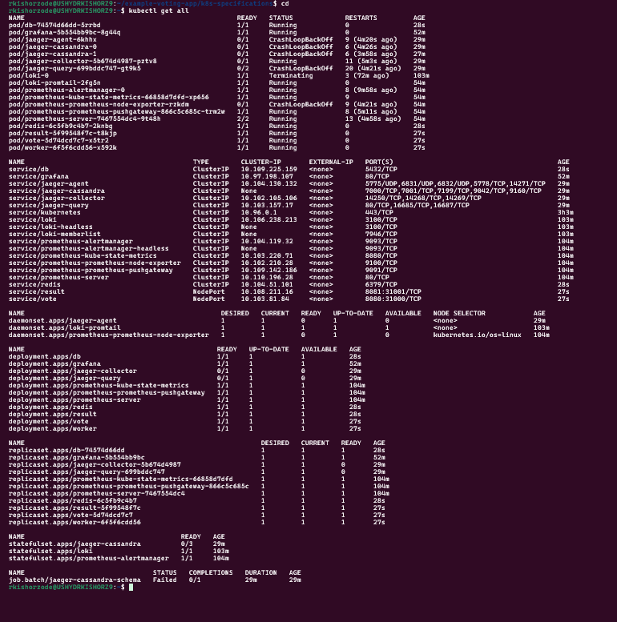

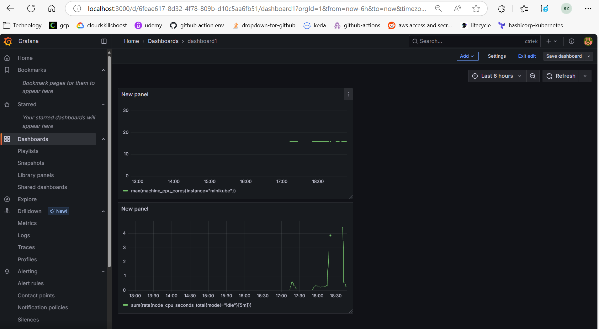

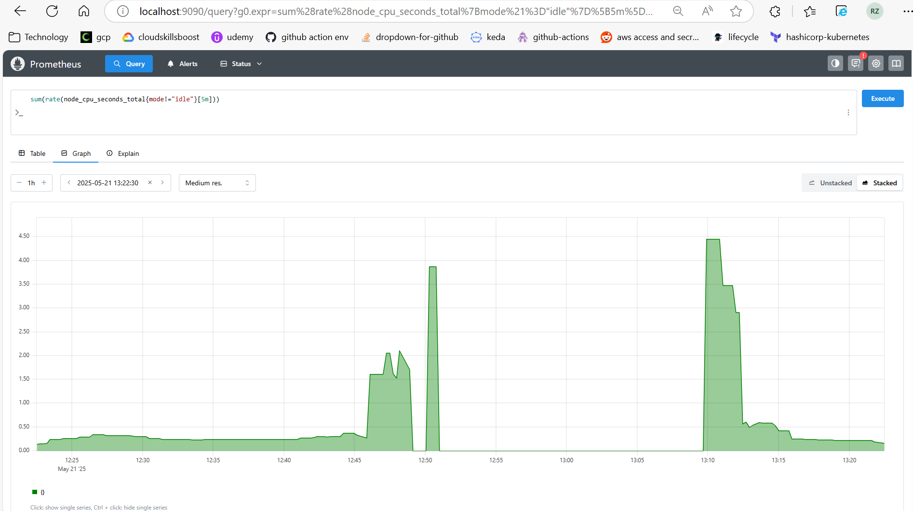

Deliverables
• Screenshot of Grafana dashboard showing both metrics and logs.
• Brief description (2–3 lines) of how these tools helped gain visibility.
Assignment 2: Application Performance Monitoring with Jaeger and Grafana
Tasks 
1. Integrate Jaeger with a sample application for Distributed Tracing:
• Set up Jaeger to collect and visualize traces from the application.
• Ensure the application is instrumented to send trace data to Jaeger.
2. Integrate Jaeger into Grafana:
• Create a Grafana dashboard that includes trace data from Jaeger .
Deliverables
• Screenshot of Grafana Dashboard.
• A screenshot showing the Grafana dashboard with trace data.

