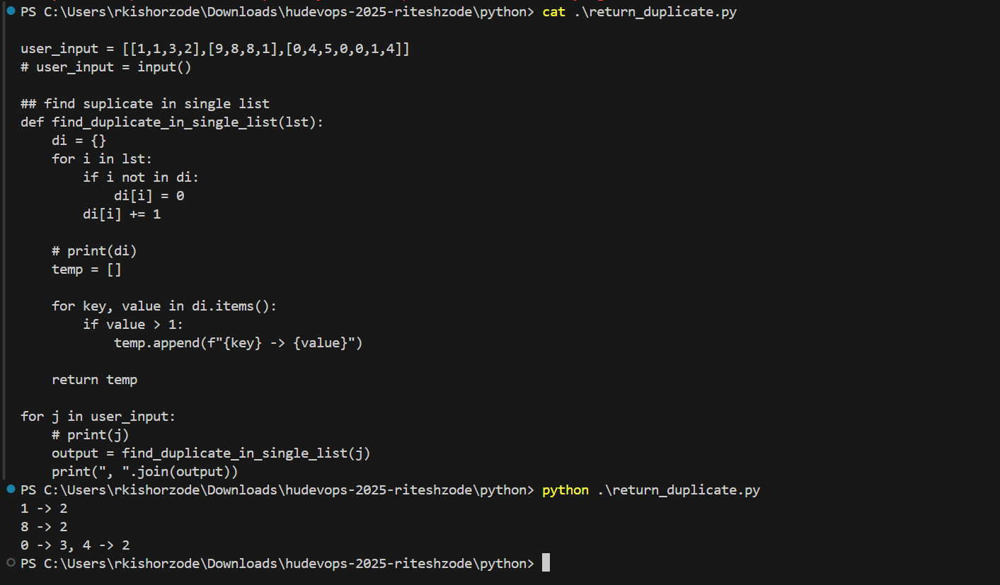
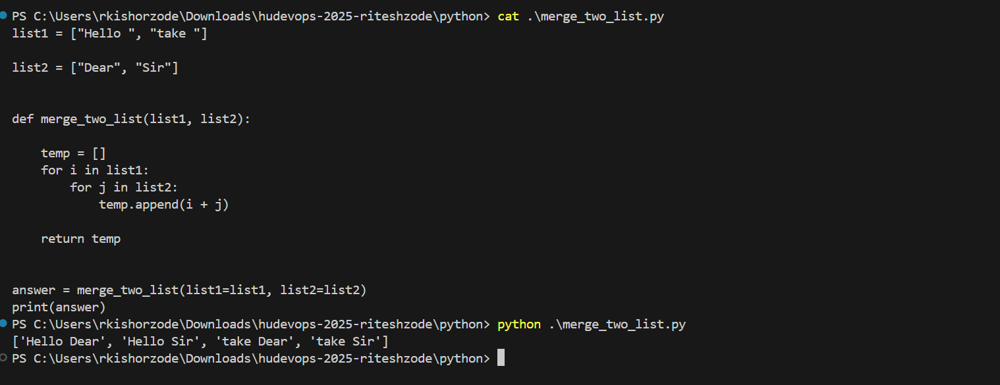
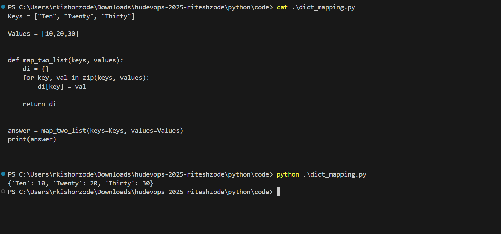
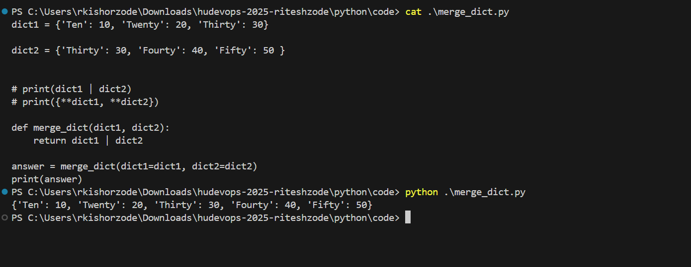
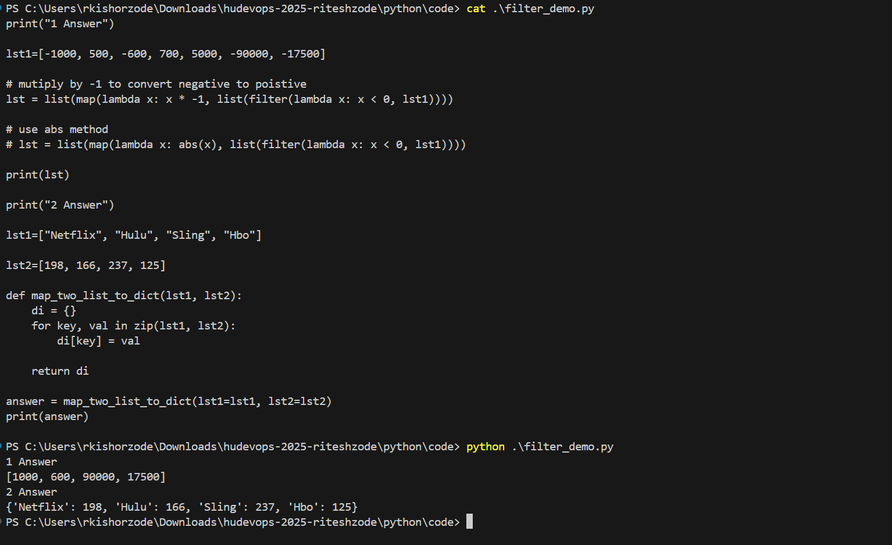
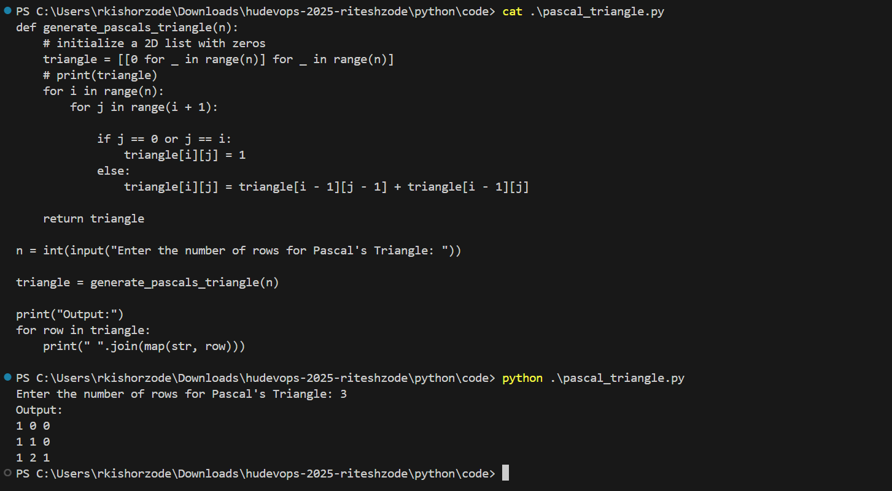
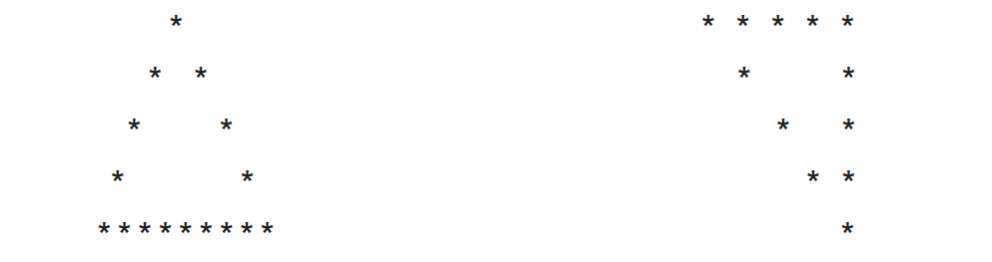

## Python Assignments :  

### Loops and Dictionaries: 

### Problem  – Data Structures 
```
Return all the duplicate values from list of arraylist 
Input:  
[[1,1,3,2],[9,8,8,1],[0,4,5,0,0,1,4]] 
Output:  
1 -> 2 
8 -> 2 
0 -> 3, 4 -> 2 
```

code: code/return_duplicate.py




Merge two lists as shown below 

```
Given I/P 
list1 = ["Hello ", "take "] 

list2 = ["Dear", "Sir"] 
E/O 
['Hello Dear', 'Hello Sir', 'take Dear', 'take Sir']
```

code: code/merge_two_list.py




### Dictionaries 

Map the dictionary in the following manner 
Keys = [‘Ten’, ‘Twenty’, ‘Thirty’] 

Value = [10,20,30] 

code: code/dict_mapping.py




Merge following two Python dictionaries into one


dict1 = {'Ten': 10, 'Twenty': 20, 'Thirty': 30} 

dict2 = {'Thirty': 30, 'Fourty': 40, 'Fifty': 50 }

code: code/merge_dict.py




### Filters:

1. Convert a number to positive if it's negative in the list. Only pass those that are converted from negative to positive to the new list. 

Note: map() function is inside filter() function.     

lst1=[-1000, 500, -600, 700, 5000, -90000, -17500] 

2. Using zip and dict functions create a dictionary which has its key-value pairs coming from lst1 and lst2. 

lst1=["Netflix", "Hulu", "Sling", "Hbo"] 

lst2=[198, 166, 237, 125] 

code: code/filter_demo.py




### loops

1. Write a program to input an integer N from user and print pascal triangle up to N rows. 

input - 3 

Output 1: 

1 0 0  

1 1 0  

1 2 1 

code: code/pascal_triangle.py



2. Write a program to print the following pattern 



code: code/pattern.py


### Final Assignment: 

As a DevOps engineer, you will be required to gather and analyze system health information, configuration details, and website status to generate comprehensive reports. In this assignment, you will practice reading configuration data from JSON and YAML files, monitoring system specifications using the psutil library, scraping website data, and compiling a status report. 

Note : Proper usage of libraries (psutil, requests, beautifulsoup, yaml, json) has to be done . Exception handling , logging  

Task Overview: 

You will create a Python script that: 

Reads configuration data from a JSON and YAML file. 

Monitors and collects system specifications such as CPU usage, memory usage, and disk space using the psutil library. 

Scrapes a website for status-related information such as HTTP status code, page title, and headings. 

Generates a detailed status report (create report in JSON file  )that includes : 

Deployment configuration details from the JSON file.	 

Service configuration details from the YAML file. 

Current system specifications (CPU, memory, disk usage). 

Scraped data from the website (HTTP status, page title, headings). 
 
Website Link : https://www.python.org/ 
 

JSON File Link: 

{ 

  "deployment_name": "Microservice-A", 

  "environment": "production", 

  "max_retries": 5, 

  "server_url": "https://www.python.org/" 

} 


YAML File Link: 

microservice_enabled: true 

max_connections: 100 

database_url: "mongodb://localhost:27017" 

log_level: "info" 

### project completed


