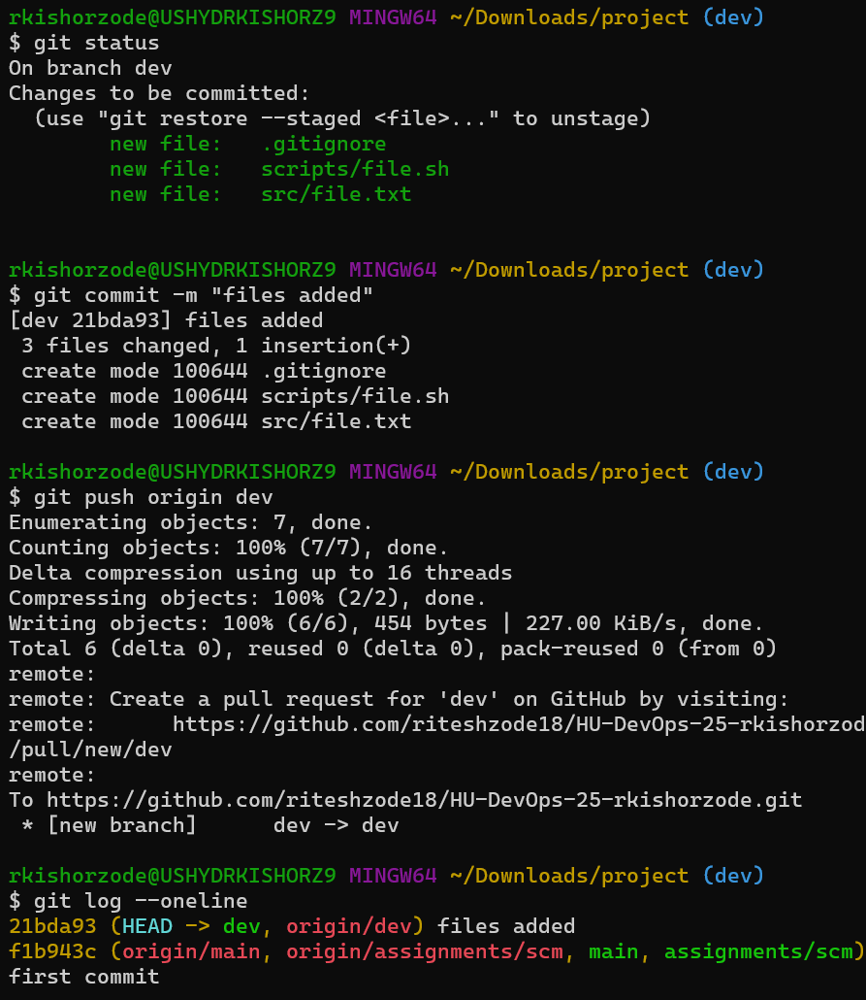
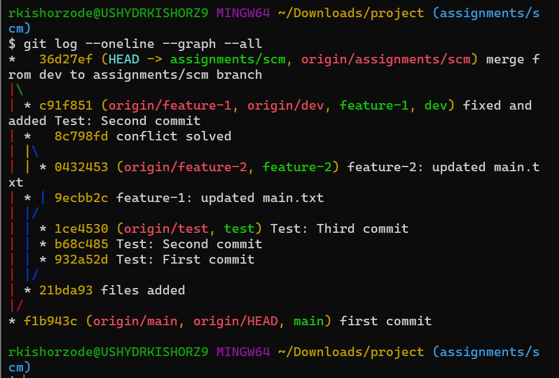
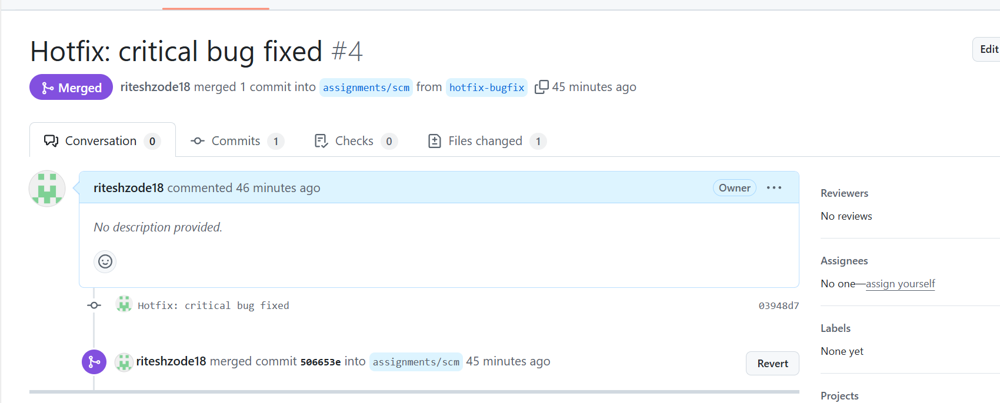
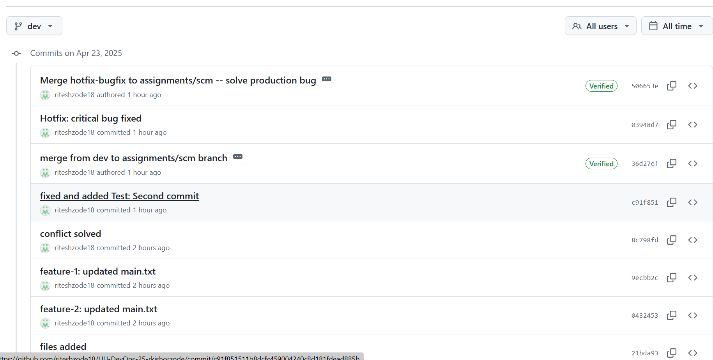
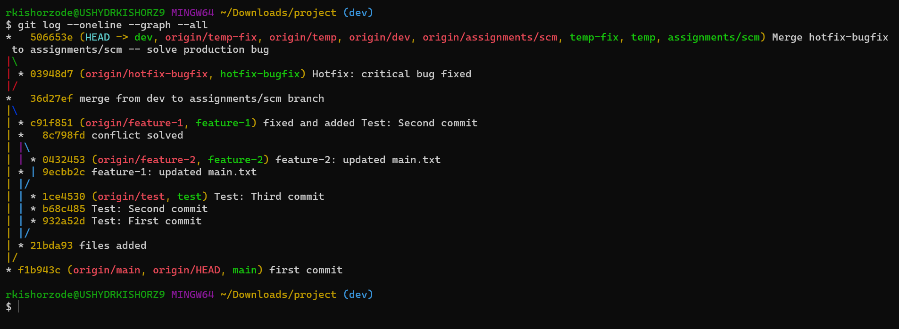
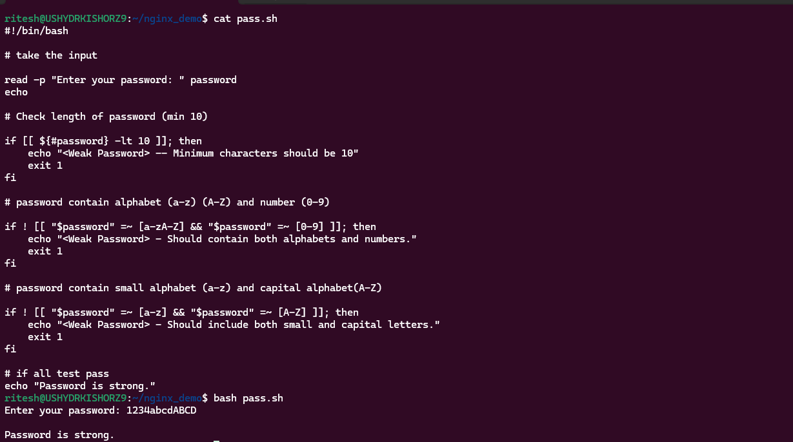
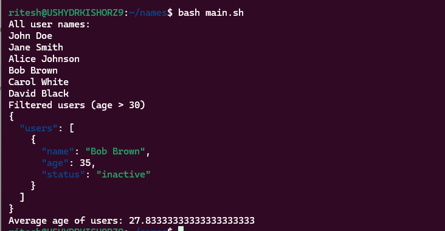
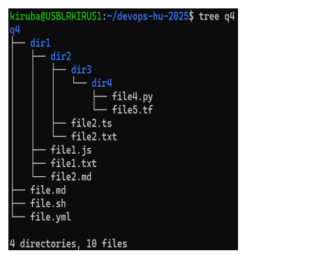
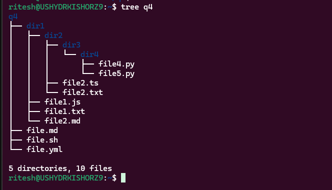
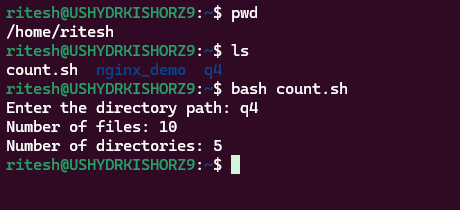

### Git questions:


## 1st question git project url

[project code](https://github.com/riteshzode18/HU-DevOps-25-rkishorzode/tree/assignments/scm)

```
https://github.com/riteshzode18/HU-DevOps-25-rkishorzode/tree/assignments/scm
```

1.

i. Explain the use of Git LFS, and how it can be configured for a repository that frequently deals with large binary files.

```
git lfs is use to track large files in git

```

ii. Initialization and Remote management:
Initialize a Git repository locally in a directory with naming convention SCM_Scripting, and complete following instruction:
```
git init
```

o Establish a connection to your remote repo in GitHub. -> HU-DevOps-25-<Deloitte_id>

```
git remote add origin https://github.com/riteshzode18/HU-DevOps-25-rkishorzode/
git push origin main
```

o Pull the branch assignments/scm
o create a branch name dev from it, and work on this branch.
o set up similar folder structure depicted below.
o And commit files while ensuring all .tmp files inside src folder alone are not tracked by Git.



iii. Branching and Merging
Assuming you are working on some development of two new features. You will create two feature branches from the dev branch. And, you have created a third branch test.

o In both the feature branches you work on same file (main.txt), make a commit respectively in both branches.
o Merge feature2 into feature1.
o Create three commits in test branch. Now, you want only the second commit changes to be added in your feature1.
o Finally merge the feature1 to dev and delete all the branches except assignments/scm and dev.
git 
iv. Finally push all these changes to the repo.
o Create a Pull request to merge dev into assignments/scm, and merge it.
o Also make sure your local repo is up to date with your remote repo.




2.

i. Commit history management and snapshotting.
You have made 4 new commits in dev and realized that some of the changes need to be undone or modified.
o You need to remove the last commit from history without having the changes in that commit lost.
o Now that you have uncommitted changes in your working directory. You also realize that the second last commit contains mistakes that need to be removed by you. You need to undo the changes made in that specific commit without losing your current uncommitted changes or commit history.
o Once the changes are undo continue with your uncommited changes.
o Explain and show how you are managing the above issues.

```
git checkout dev
git reset --soft HEAD~1
git stash
git reset --hard HEAD~1
git stash list
git stash pop
git add .
git commit -m "fixed mistake and continue working"
```

ii. Let’s assume a scenario, where your code in the assignments/scm branch is in production, and a bug is discovered that needs an immediate fix. So, you create a hotfix branch, make the necessary changes, and push the fix to the assignments/scm branch.

o Make sure the all the changes to main goes through PR.


`
o Now, you already have changes in dev as part of ongoing development. And you need to ensure that the dev branch maintains a linear commit history with the main branch after the hotfix, by making sure that new commits in the main are added to your dev commit history. How are you going to handle it?

Submission Requirements:
• Provide proper screenshots of your terminal of execution of all the git commands.
• Include a screenshot of your folder structure in the file explorer, contents of the file wherever required.
• Include commit history log wherever required to showcase the completion.
• Include proper comments and explanation to all the images and details documented.

## create linear history in dev branch


```
https://github.com/riteshzode18/HU-DevOps-25-rkishorzode/commits/dev/
```

## complte flow 


### Shell Scripting questions:

1. System Information and Password Strength Shell Script

i. Write a shell script to perform the following tasks:
o Find OS version, kernel version, uptime, memory, cores, and swap details of a Linux machine.
o Show free & available memory.
o Show cache memory.
o Increase the ulimit for the current user to 1028.
o Change the time zone to Brussels, Belgium.

```
system_info.sh
#!/bin/bash

echo "System Information"

echo "OS Version:"
cat /etc/os-release

echo "Kernel Version:"
uname -r

echo "Uptime:"
uptime

echo "Memory Details:"
free -h

echo "CPU Cores:"
nproc

echo "Swap Details:"
swapon --show

echo "Free & Available Memory"
free -h

echo "Cache Memory"
free -h | grep "buff/cache"

echo "Increasing ulimit"


sudo timedatectl set-timezone Europe/Brussels
echo "Current Time Zone:"
timedatectl

```

ii. Create a shell script to assess password strength:
o Minimum characters should be 10.
o Should contain both alphabet and number.
o Should include both small and capital case letters.
o If the password doesn’t comply with any of the above conditions, then the script should report it as a <Weak Password>.

```
password.sh
#!/bin/bash

# take the input

read -p "Enter your password: " password
echo

# Check length of password (min 10)

if [[ ${#password} -lt 10 ]]; then
    echo "<Weak Password> -- Minimum characters should be 10"
    exit 1
fi

# password contain alphabet (a-z) (A-Z) and number (0-9)

if ! [[ "$password" =~ [a-zA-Z] && "$password" =~ [0-9] ]]; then
    echo "<Weak Password> - Should contain both alphabets and numbers."
    exit 1
fi

# password contain small alphabet (a-z) and capital alphabet(A-Z)

if ! [[ "$password" =~ [a-z] && "$password" =~ [A-Z] ]]; then
    echo "<Weak Password> - Should include both small and capital letters."
    exit 1
fi

# if all test passed
echo "Password is strong."

```


2. JSON Data Processing, File Structure, and Nginx Deployment Shell Script

i. Write a shell script to perform the following tasks:
o Extract all the names from a JSON file and display them.
o Filter the JSON data where the user age is above 30 and create a new JSON file with the filtered data.
o Calculate the average age of all users and display it.
Use the below json file:
```
{
"users": [
{
"name": "John Doe",
"age": 30,
"status": "inactive"
},
{
"name": "Jane Smith",
"age": 22,
"status": "inactive"
},
{
"name": "Alice Johnson",
"age": 27,
"status": "inactive"
},
{
"name": "Bob Brown",
"age": 35,
"status": "inactive"
},
{
"name": "Carol White",
"age": 29,
"status": "inactive"
},
{
"name": "David Black",
"age": 24,
"status": "inactive"
}
]
}
```

```
#!/bin/bash

JSON_FILE="users.json"

# 1. Extract all the names from a JSON file and display them
echo "All user names:"
jq -r '.users[].name' "$JSON_FILE"


# 2. Filter the JSON data where the user age is above 30 and create a new JSON file with the filtered data
echo "Filtered users (age > 30)"
jq '{users: [.users[] | select(.age > 30)]}' "$JSON_FILE"


# 3. Calculate the average age of all users and display it.
# 3. Calculate the average age of all users
TOTAL_AGE=$(jq '[.users[].age] | add' "$JSON_FILE")
USER_COUNT=$(jq '.users | length' "$JSON_FILE")
AVERAGE_AGE=$(echo "$TOTAL_AGE / $USER_COUNT" | bc -l)

echo "Average age of users:" "$AVERAGE_AGE"
```


ii. Write a shell script to create the specified file structure.


```
foulder_create.sh
#!/bin/bash

mkdir q4
cd q4

mkdir -p dir1/dir2/dir3/dir4

touch file.md file.sh file.yml

touch dir1/file1.js
touch dir1/file1.txt
touch dir1/file2.md

touch dir1/dir2/file2.ts
touch dir1/dir2/file2.txt

touch dir1/dir2/dir3/dir4/file4.py
touch dir1/dir2/dir3/dir4/file5.py

cd ..
tree q4

```


iii. Write a shell script that takes a directory as input(q4) and counts the total number of different types of files and directories present in the input directory. Check if a file is executable, and if it is a .sh file, decide whether it is executable or not.
o expected Output – File 'q4/file.sh' is not executable or found File 'q4/file.sh' has been made executable sh: 1 py: 1 yml: 1 md: 2 ts: 1 tf: 1
js: 1 txt: 2 directories: 5

```
count.sh
#!/bin/bash

# Prompt the user to enter a directory
read -p "Enter the directory path: " dir

# Check if the directory exists
if [[ ! -d "$dir" ]]; then
    echo "Directory '$dir' does not exist."
    exit 1
fi

# Count the number of files
file_count=$(find "$dir" -type f | wc -l)

# Count the number of directories
dir_count=$(find "$dir" -type d | wc -l)

# Display the nos
echo "Number of files: $file_count"
echo "Number of directories: $dir_count"
```


iv. Write a shell script named deploy_nginx.sh to:
o Check if Nginx is installed on the system.
o If Nginx is not installed, install it using the appropriate package manager.
o Copy a custom HTML file (should print your name) to the Nginx HTML directory.
o Restart the Nginx service to apply the changes.
o Attach a screenshot of the custom webpage in the browser.
```
deploy_nginx.sh

#!/bin/bash
if ! command -v nginx > /dev/null 2>&1;
then
  echo "Nginx is not install"
  sudo apt update -y && sudo apt install nginx -y
  echo "Nginx install done"
else
  echo "Nginx is install"
fi

echo "<h1>Ritesh Zode</h1>" > content.html

sudo cp content.html /var/www/html/index.html

sudo systemctl restart nginx

echo "Deployment Success"
```


3. Text Processing and Backup Shell Script and a PowerShell Backup Script
I. Write a shell script named text_processing.sh to perform specific text processing operations on a file named data.txt:
o The data.txt should contain multiple lines of data with each line containing data about a person in the format -> name, age, designation.
o The script should read the data.txt file and print the following:
 Total number of people in each designation.
 All the existing people names.
 Replace the designation "Manager" with "Team Lead" in the text file.
II. Create a shell script named backup.sh to:
o Create shell script which should copy only the text file from directory1 (text file should be there in nested folders as well) to backup directory.
o The script should create additional 2 files (error.log, backup.log) in current directory where error.log should store log of error if any and backup should store log of text files which was copied in the below format.
 <Timestamp> - Backed up - < path of the target file > Example: 2025-04-09 10:43:02 – Backed up - file1.txt to q4/dir1/dir2/file.txt
o The script should also run the script created in above question (3.I)
o Handle errors, such as no directory or no backup folder.
III. Write a PowerShell script to:
o Copy all files from the source directory to the backup directory.
o Create backup.log file and store all the logs of the copied files with the below format: <Timestamp> – Copied file: <source file name> to <path of the target file>. Example: 2025-04-09 10:43:02 – Copied file: file1.txt to C:\Users\user1\backup\file1.txt


```
data.txt

John Doe, 30, Manager
Jane Smith, 25, Developer
Alice Johnson, 35, Manager
Bob Brown, 28, Developer
Carol White, 40, Designer
David Black, 32, Manager
Emily Davis, 29, Developer
Frank Harris, 45, Designer
Grace Lee, 38, Manager
```

```
text_processing.sh
#!/bin/bash

# Check if data.txt exists
if [[ ! -f "data.txt" ]]; then
    echo "Error: data.txt file not found!"
    exit 1
fi

# Total number of people in each designation
# add filetr on designation and do count


# List all existing people names
echo "people names"
awk -F, '{print $1}' data.txt

# Replace "Manager" with "Team Lead" in the file
echo "Replacing 'Manager' with 'Team Lead'"
sed -i 's/Manager/Team Lead/g' data.txt
echo "Replacement done. Updated file:"
cat data.txt
```

```
backup.sh
#!/bin/bash

# source dirctry
source_dir=foulder_source
# destination directry
destination_dir=foulder_dest


# check if directry exist or create it

# copy all files and foulder form soure to destination directry

# all logs will be created in logs file
1. backup logs
2. error logs

echo "backup successs"

```

### same logic in powershell
