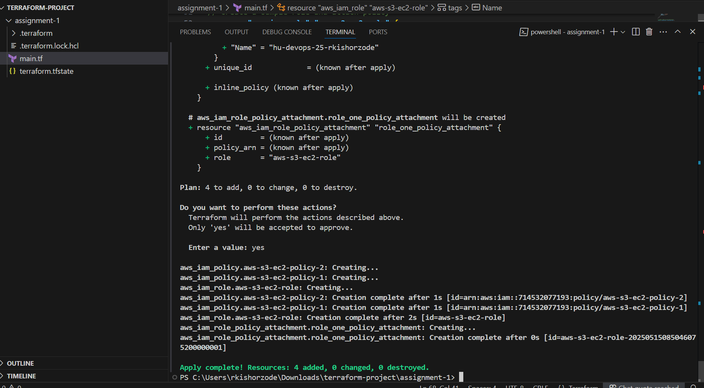
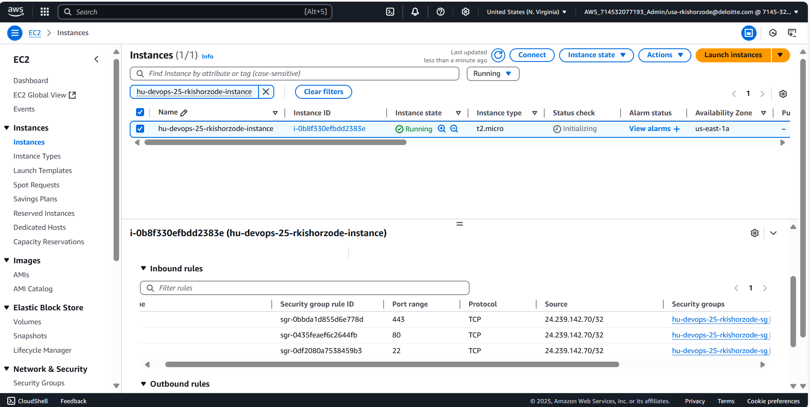

### terraform Assignment

Q 1: Create an AWS IAM Role for S3 and EC2 Services Using Terraform. 

Objective: Define an AWS IAM role with the necessary policies to manage S3 buckets and EC2 instances. 

Tasks: 

Create an IAM role with permissions to access and manage AWS S3 and EC2 services. 

Attach policies that allow necessary actions on S3 and EC2, ensuring compliance with the principle of least privilege. 

Q 2: Deploy an EC2 Instance with Security Group Using Terraform 

Objective: Write a Terraform configuration to create an EC2 instance along with a security group that allows specific inbound and all outbound traffic. 

Tasks: 

Define a Terraform configuration to provision an EC2 instance. 

Configure a security group that allows inbound SSH, HTTP, and HTTPS traffic from your system's IP address, and permits all outbound traffic. 

Q 3: Use Terragrunt to Manage S3 Buckets Across Environments 

Objective: Deploy S3 buckets in multiple environments (two) using Terragrunt to manage variations in configuration. 

Tasks: 

Create a Terragrunt configuration to deploy an S3 bucket in two different environments (e.g., staging and production). 

Configure the S3 bucket settings to suit the needs of each environment, such as versioning and access policies. 

Q 4: Configure Azure Blob Storage and CDN 

Objective: Set up Azure Blob Storage and a CDN to host and distribute an HTML page. 

Tasks: 

Deploy Azure Blob Storage and upload an HTML page. 

Set up Azure CDN to serve the HTML page stored in Blob Storage, ensuring optimal load times globally. 

Q 5: Create Google Cloud Run and Container Registry 

Objective: Establish a Google Cloud Run service and a Container Registry to manage and deploy containerized applications. 

Tasks: 

Create a Google Container Registry to store Docker images. 

Deploy an application using Google Cloud Run that pulls the necessary image from the Google Container Registry. 

 
